# Python Utilities

[](https://www.python.org/downloads/)
[](https://opensource.org/licenses/MIT)
[](https://github.com/psf/black)
[](https://github.com/UBags/python_utilities/stargazers)
[](https://github.com/UBags/python_utilities/network)
[](https://github.com/UBags/python_utilities/issues)
[](http://makeapullrequest.com)

> Production-ready utilities for modern Python applications. Battle-tested patterns for APIs, microservices, and data pipelines.

[⭐ Star us on GitHub](https://github.com/UBags/python_utilities) | [📖 Documentation](https://github.com/UBags/python_utilities#readme) | [🚀 Quick Start](https://github.com/UBags/python_utilities#quick-start)

---

## 💡 Real-World Power Examples

### Example 1: Bulletproof Payment Charging (the headline stack)

This is the kind of decorator stack you build a payments library for. One function, six declarative decorators, and the ten payment requirements stop being a checklist and start being something the type checker can read:

```python
from datetime import timedelta
from python_utilities.decorators import (
    retry, circuit_breaker, rate_limit, timer, log_execution,
)
from payments import idempotent, InMemoryIdempotencyStore, NetworkError

idempotency_store = InMemoryIdempotencyStore()  # In production: Redis-backed.
gateway = ...  # Your PaymentGateway adapter (Stripe, Adyen, etc.)

@idempotent(idempotency_store, payload_arg="charge_request", ttl_seconds=86400)
@circuit_breaker(failure_threshold=5, recovery_timeout=30.0)
@retry(max_attempts=3, delay=0.5, backoff=2.0, exceptions=(NetworkError,))
@rate_limit(max_calls=100, period=timedelta(minutes=1))
@timer(metric_name="charge_duration")
@log_execution(log_args=True, log_result=True)
def charge_customer(charge_request: dict, idempotency_key: str) -> dict:
    return gateway.authorize(...)
```

**The order is the point.** `@idempotent` is outermost: a duplicate request returns the cached result and skips everything below. That is *also* what makes `@retry` underneath it safe — a retried network failure won't double-charge, because the second attempt hits the same idempotency record. Reverse them and you get the exact failure mode payments engineering exists to prevent.

What each layer adds:

| Layer | Purpose | Failure mode prevented |
|---|---|---|
| `@idempotent` | Dedups on `Idempotency-Key`; rejects mismatched payloads on key reuse | Duplicate charges from client retries / browser refresh / network timeouts |
| `@circuit_breaker` | Opens after repeated gateway failures; fails fast for `recovery_timeout` | Cascading failure when the gateway is down |
| `@retry` | Exponential backoff on `NetworkError` only — never on `CardDeclinedError` | Transient blips causing real declines |
| `@rate_limit` | Caps outbound calls per window | Card-testing attacks; gateway TPS overage fees |
| `@timer` | Emits a duration metric | SLO blindness |
| `@log_execution` | Audit trail of every charge attempt | Disputes that can't be reconstructed (PCI redaction filter scrubs the output) |

See the [Payments Subpackage](#payments-subpackage) section below for the package layout, every module, and a full e-commerce checkout that wires this together with a Saga, fraud screening, webhook handling, and reconciliation.

---

### Example 2: Bulletproof External API Client
```python
from python_utilities.decorators import retry, circuit_breaker, rate_limit, cached
from datetime import timedelta

@retry(max_attempts=3, delay=1.0, backoff=2.0)
@circuit_breaker(failure_threshold=5, recovery_timeout=60.0)
@rate_limit(max_calls=100, period=timedelta(minutes=1))
@cached(ttl_seconds=300)
async def fetch_external_api(endpoint: str):
    """
    Production-ready API client with:
    - Automatic retries with exponential backoff
    - Circuit breaker to prevent cascade failures
    - Rate limiting to respect API quotas
    - 5-minute response caching
    """
    return await http_client.get(f"https://api.example.com/{endpoint}")
```

### Example 3: High-Throughput Background Job Processor
```python
from python_utilities.async_utils import AsyncQueue, AsyncBatchProcessor
from python_utilities.decorators import timer, log_execution
from python_utilities.context_managers import database_session

@timer(metric_name="job_processing_duration")
@log_execution(log_args=False, log_result=True)
async def process_job(job_data):
    """
    Scalable job processor combining:
    - Async queue with configurable workers
    - Batch processing for efficiency
    - Database transactions with auto-rollback
    - Performance monitoring
    """
    async with database_session(AsyncSessionFactory) as session:
        result = await execute_business_logic(job_data, session)
        return result

# Setup: 10 workers processing jobs, auto-batching every 100 items or 5 seconds
queue = AsyncQueue(num_workers=10, process_func=process_job)
batch_processor = AsyncBatchProcessor(
    batch_size=100,
    flush_interval=5.0,
    process_func=save_to_database
)
```

### Example 4: Event-Driven Microservice with Clean Architecture
```python
from python_utilities.patterns import Repository, UnitOfWork, EventBus, Event
from python_utilities.dependency_injection import DIContainer, Lifecycle
from python_utilities.validation import validate_with_pydantic

# Layer 1: Repository Pattern for data access
class OrderRepository(Repository[Order, int]):
    def __init__(self, db_session):
        self.db = db_session

# Layer 2: Unit of Work for transaction management
class AppUnitOfWork(UnitOfWork):
    def __init__(self, session):
        super().__init__()
        self.orders = OrderRepository(session)
        self.inventory = InventoryRepository(session)
        self.session = session
    
    def _commit(self):
        self.session.commit()
    
    def _rollback(self):
        self.session.rollback()

# Layer 3: Service with validation and events
class OrderService:
    def __init__(self, uow: AppUnitOfWork, event_bus: EventBus):
        self.uow = uow
        self.event_bus = event_bus
    
    @validate_with_pydantic(input_model=OrderCreate, output_model=OrderResponse)
    async def create_order(self, order_data: dict) -> dict:
        """
        Clean architecture combining:
        - Repository pattern for data access
        - Unit of Work for atomic transactions
        - Pydantic validation for type safety
        - Event bus for loose coupling
        - Dependency injection for testability
        """
        with self.uow as uow:
            # All operations atomic - commit together or rollback
            order = uow.orders.create(Order(**order_data))
            uow.inventory.reserve_stock(order.product_id, order.quantity)
        
        # Publish event after successful commit
        await self.event_bus.publish(Event(
            event_type='order_created',
            data={'order_id': order.id, 'user_id': order.user_id}
        ))
        
        return order

# Dependency Injection wiring
container = DIContainer()
container.register(AppUnitOfWork, AppUnitOfWork, lifecycle=Lifecycle.SCOPED)
container.register(EventBus, EventBus, lifecycle=Lifecycle.SINGLETON)
container.register(OrderService, OrderService)

# Auto-resolves all dependencies!
order_service = container.resolve(OrderService)
```

---

# Payments Subpackage

The `payments/` subpackage provides production primitives for payment systems built on top of `python_utilities`. It is gateway-agnostic — bring your own Stripe / Adyen / Braintree adapter — and it is composable with every decorator and pattern from the rest of this library.

It exists because **a payments system is not just an HTTP client to a gateway**. The hard parts are idempotency, distributed transaction consistency, signature verification, fraud screening, log redaction, and end-of-day reconciliation. Each of those is a module here.

## Why a separate package

Generic decorators like `@retry` and `@cached` are not enough on their own. `@cached` does not enforce idempotency (it doesn't reject mismatched payloads on key reuse, and it isn't durable across restarts). `@retry` is *unsafe* in front of a payment endpoint *unless* something further out enforces idempotency — otherwise a transient timeout becomes a duplicate charge. The `payments` subpackage supplies the missing primitives that make the existing decorators safe to use against money.

## Module layout

```
payments/
├── __init__.py           # public exports
├── errors.py             # typed PaymentError hierarchy with `retriable` flag
├── idempotency.py        # @idempotent decorator + pluggable store
├── saga.py               # Saga orchestrator with compensations
├── webhooks.py           # HMAC verifier, replay window, dedup helper
├── redaction.py          # PCI-aware log filter + Tokenizer interface
├── fraud.py              # Composable rule engine
├── reconciliation.py     # Internal-ledger ↔ gateway-report comparator
└── gateway.py            # Abstract PaymentGateway Protocol
```

| Module | Responsibility | Key public API |
|---|---|---|
| `errors` | Typed exception taxonomy that drives retry vs compensate decisions | `PaymentError`, `NetworkError`, `CardDeclinedError`, `FraudBlockedError`, `IdempotencyConflictError`, `SagaCompensationError` |
| `idempotency` | Deduplicate retries; persist results across attempts | `@idempotent`, `IdempotencyStore`, `InMemoryIdempotencyStore`, `hash_payload` |
| `saga` | Run multi-step transactions with compensation on failure | `Saga`, `SagaState`, `SagaExecution`, `assert_saga_succeeded` |
| `webhooks` | Verify gateway callbacks; reject replays and duplicates | `WebhookVerifier`, `is_first_delivery`, `InMemoryDedupStore` |
| `redaction` | Scrub PAN/CVV/track data from logs; tokenize PANs | `redact()`, `PCIRedactionFilter`, `EphemeralTokenizer`, `install_root_redaction_filter()` |
| `fraud` | Pre-charge rule engine: AVS/CVV, velocity, blocklist, country, amount | `FraudEngine`, `FraudContext`, `Decision`, `velocity_rule`, `avs_cvv_rule` |
| `reconciliation` | Daily comparison of internal ledger vs gateway report | `Reconciler`, `Discrepancy`, `DiscrepancyType`, `TransactionRecord` |
| `gateway` | Abstract Protocol so business code is gateway-agnostic | `PaymentGateway`, `ChargeRequest`, `ChargeResult`, `RefundRequest` |

## Mapping to the ten payment requirements

| Requirement | Where it lives |
|---|---|
| 1. Idempotency for all payment operations | `idempotency.py` — `@idempotent` with durable store + payload hashing |
| 2. PCI DSS scope reduction | `redaction.py` (filter) + `gateway.py` (tokens-only API surface) |
| 3. Tokenization + data minimization | `redaction.Tokenizer` Protocol + `EphemeralTokenizer` for tests |
| 4. Encryption in transit / at rest | Deployment concern; this package never touches raw PANs |
| 5. Layered fraud prevention | `fraud.py` — composable rules + risk scoring |
| 6. SCA / regulatory compliance | `fraud.py` raises `AuthenticationRequiredError` to trigger 3DS step-up |
| 7. Distributed transaction consistency | `saga.py` — orchestrator + compensations + durable log hook |
| 8. Logging, auditing, reconciliation | `redaction.py` (audit-safe logs) + `reconciliation.py` |
| 9. Secure webhook handling | `webhooks.py` — HMAC + replay window + event-ID dedup |
| 10. Resilience & rate limiting | Composes with existing `@retry`, `@circuit_breaker`, `@rate_limit` |

## Idempotency

Every payment endpoint must be idempotent. The pattern: client sends an `Idempotency-Key` header; server hashes the request payload and stores `(key, payload_hash, state, result)` in a durable store. Subsequent retries with the same key+payload return the stored result without re-executing.

```python
from payments import idempotent, InMemoryIdempotencyStore

store = InMemoryIdempotencyStore()  # In production: Redis-backed.

@idempotent(store, payload_arg="charge_request", ttl_seconds=86400)
def create_charge(charge_request: dict, idempotency_key: str) -> dict:
    return gateway.authorize(**charge_request)

# First call: processes and stores result.
r1 = create_charge(charge_request={"amount": 100, "card": "tok_x"},
                   idempotency_key="abc-123")
# Same key + same payload -> returns cached result, no re-call.
r2 = create_charge(charge_request={"amount": 100, "card": "tok_x"},
                   idempotency_key="abc-123")
assert r1 == r2  # same charge_id

# Same key + DIFFERENT payload -> IdempotencyConflictError (hard 4xx).
create_charge(charge_request={"amount": 200, "card": "tok_x"},
              idempotency_key="abc-123")  # raises
```

State machine inside the store: `IN_FLIGHT → COMPLETED` (or `→ FAILED` for terminal errors like `CardDeclinedError`). Replays of a `FAILED` key re-raise the original error rather than retrying — the caller already asked for this exact operation and got their answer. Retriable errors clear the slot so the client *can* retry.

The `IdempotencyStore` interface is two atomic operations: `set_if_absent` and `update`. In Redis that's `SET key value NX EX <ttl>`; in PostgreSQL it's an `INSERT ... ON CONFLICT DO NOTHING` with a row-level update.

## Saga orchestration

When a checkout spans multiple services (inventory, payments, shipping), there is no ACID transaction that covers all of them. The Saga pattern replaces that with a sequence of local transactions, each paired with a compensating action that undoes it. If step N fails, steps N-1 down to 1 are compensated in reverse order.

```python
from payments import Saga, SagaState, InMemorySagaLog, assert_saga_succeeded

saga = Saga(name="checkout", log=InMemorySagaLog())
saga.add_step("reserve_inventory", inventory.reserve, compensate=inventory.release)
saga.add_step("authorize_payment", payments.authorize, compensate=payments.void)
saga.add_step("capture_payment",   payments.capture)   # no compensation needed
saga.add_step("create_shipment",   shipping.create)    # final step

execution = await saga.execute({"order_id": "ord_123", "amount": 5000})

if execution.state == SagaState.COMPLETED:
    return execution.context  # success
elif execution.state == SagaState.COMPENSATED:
    return error_response("Order failed; charges reversed.")
elif execution.state == SagaState.FAILED_COMPENSATION:
    page_oncall(execution)  # the worst case — manual reconciliation needed
```

Compensations themselves can fail. The orchestrator retries each compensation up to `compensation_retries` times with linear backoff. If a compensation still fails, the saga ends in `FAILED_COMPENSATION` and `SagaCompensationError` is raised by `assert_saga_succeeded()` — this is a page-the-on-call event because the system is now in an inconsistent state.

The `SagaLog` Protocol records every state transition so a recovery process can resume in-flight sagas after a crash. Combine with `@idempotent` on the underlying step functions — that's what makes resumption safe.

## Webhook verification

Webhooks must be verified or an attacker who knows your endpoint URL can forge events and trigger fulfillment without paying. Three independent guarantees:

```python
from payments import WebhookVerifier, InMemoryDedupStore, is_first_delivery

verifier = WebhookVerifier(
    secret=os.environ["STRIPE_WEBHOOK_SECRET"],
    replay_window_seconds=300,
)
dedup = InMemoryDedupStore()  # In production: Redis with TTL.

def handle_webhook(raw_body: bytes, signature_header: str) -> int:
    # 1. Authenticity: HMAC-SHA256 against shared secret.
    # 2. Freshness: timestamp must be within replay_window_seconds.
    try:
        verifier.verify(raw_body, signature_header)
    except (WebhookSignatureError, WebhookReplayError):
        return 400

    # 3. At-most-once: dedup on the gateway-provided event ID.
    event = json.loads(raw_body)
    if not is_first_delivery(event["id"], dedup):
        return 200  # already processed; ack so gateway stops retrying

    process_event(event)
    return 200
```

**Always verify against the raw request body, not a re-serialized JSON.** Even one byte of difference (whitespace, key reordering by your framework's JSON middleware) breaks HMAC. Capture the body before any parsing layer runs.

The signature scheme follows Stripe's convention (`t=<timestamp>,v1=<sig>`); multiple `v1=` entries are accepted to support secret rotation. Adapt the verifier for other gateways by parameterizing the parser.

## PCI-aware log redaction

Logs are the silent PCI violation. One log line containing a card number puts your entire log infrastructure — and everyone who can read it — in scope. The `PCIRedactionFilter` is your second line of defense for when a card number escapes into a log call:

```python
from payments import install_root_redaction_filter
import logging

logging.basicConfig(level=logging.INFO)
install_root_redaction_filter()  # Attaches filter to every root handler.

logger = logging.getLogger(__name__)
logger.info("Customer support note: card 4111-1111-1111-1111 cvv: 999 was used")
# Logged as: "Customer support note: card ************1111 cvv: [REDACTED_CVV] was used"
```

What gets redacted: PANs (13–19 digit sequences passing a Luhn check, with space/dash tolerance), labelled CVV/CVC fields, Track 1/2 magnetic stripe data. What does *not* get redacted: card brands, last-4 in isolation, expiry dates — these are routinely needed for support and aren't sensitive authentication data under PCI DSS.

The first line of defense is to never let raw PANs into your servers in the first place — use a tokenization gateway (Stripe Elements, Adyen Hosted Fields) so PANs go directly from the user's browser to the vault. The `Tokenizer` Protocol is the seam your gateway adapter implements.

## Fraud rule engine

Composable rules, evaluated in order, short-circuiting on the first `BLOCK`:

```python
from payments import (
    FraudEngine, FraudContext, Decision, VelocityTracker,
    avs_cvv_rule, velocity_rule, country_mismatch_rule,
    high_amount_rule, blocklist_rule,
)

tracker = VelocityTracker()
engine = FraudEngine(rules=[
    blocklist_rule(blocked_emails=load_blocklist()),
    avs_cvv_rule(),                          # hard block on CVV/AVS mismatch
    velocity_rule(tracker, key_fn=lambda c: c.user_id,
                  max_count=5, window_seconds=3600,
                  rule_name="user_hourly"),
    country_mismatch_rule(),                  # challenge, don't block
    high_amount_rule(threshold=2000.0),       # 3DS step-up over $2k
], review_threshold=50)

result = engine.evaluate(FraudContext(
    user_id="u_42", email=order.email, amount=order.total,
    avs_result=auth.avs, cvv_result=auth.cvv,
    card_country="US", billing_country="US",
))

if result.decision == Decision.BLOCK:
    raise FraudBlockedError(f"Blocked by {result.blocked_by}")
elif result.decision == Decision.CHALLENGE:
    return redirect_to_3ds(...)
elif result.decision == Decision.REVIEW:
    flag_for_human_review(order, result)
# else APPROVE
```

Every rule's verdict is captured on the result so you can audit decisions, train models, and tune thresholds against historical data. New rules go behind a feature flag; the engine accepts any callable matching the `Rule` signature.

## Daily reconciliation

Even with idempotency, sagas, and verified webhooks, drift happens. A webhook acked but never persisted, a refund issued through the gateway dashboard, a settlement-currency rounding difference — they create gaps between what your DB believes and what the gateway recorded. Reconciliation catches them before they become a finance audit finding:

```python
from payments import Reconciler, TransactionRecord, DiscrepancyType
from decimal import Decimal

reconciler = Reconciler()
reconciler.on(DiscrepancyType.MISSING_GATEWAY, page_oncall)
reconciler.on(DiscrepancyType.MISSING_INTERNAL, replay_from_webhook_archive)

report = reconciler.reconcile(
    internal=ledger.list_transactions(yesterday),
    gateway=stripe_client.list_balance_transactions(yesterday),
)
logger.info(report.summary())
# "1248/1251 matched, 3 discrepancies: 2 missing_internal, 1 status_mismatch"
```

Discrepancy taxonomy: `MISSING_INTERNAL` (gateway has it, you don't — usually a missed webhook), `MISSING_GATEWAY` (you think it succeeded, gateway doesn't know — almost always a bug), `AMOUNT_MISMATCH`, `STATUS_MISMATCH`. Run against T-1 data — settlement and webhook delivery have lag.

`Decimal` (not `float`) for amounts: cents are exact in `Decimal` and floats accumulate rounding error that compounds across thousands of transactions.

## Typed errors that drive control flow

The `retriable` flag on `PaymentError` is what lets the rest of the package make correct decisions automatically:

```python
from payments import (
    NetworkError,            # retriable=True  -> @retry catches it
    GatewayTimeoutError,     # retriable=True  -> charge state UNKNOWN; reconcile
    RateLimitedError,        # retriable=True  -> back off
    CardDeclinedError,       # retriable=False -> surface to user, don't retry
    InsufficientFundsError,  # retriable=False
    FraudBlockedError,       # retriable=False -> compensate, don't retry
    AuthenticationRequiredError,  # retriable=False -> 3DS step-up
)

@retry(max_attempts=3, exceptions=(NetworkError, GatewayTimeoutError))
def charge(...):  # Only retries the right errors. Card declines fail fast.
    ...
```

`@idempotent` consults `retriable` too: it persists terminal failures (so a replayed key re-raises the same decline) but clears retriable failures (so the client *can* retry).

## Full e-commerce checkout example

The `ecommerce_checkout_example.py` ships with the package and runs end-to-end. It composes everything above plus the existing `python_utilities` decorators, demonstrating seven scenarios:

1. **Successful checkout with transient failure** — `@retry` recovers from two `NetworkError`s, saga completes.
2. **Idempotent replay** — same key + same payload returns cached charge, no second gateway call.
3. **Saga compensation** — shipment fails after authorize+capture; payment is voided and inventory released in reverse order.
4. **Fraud block** — blocklisted email rejected before any gateway call; saga compensates the inventory reservation.
5. **Webhook handling** — valid signature accepted, replay deduplicated, tampered body rejected.
6. **Reconciliation** — three discrepancies surfaced, on-call paged for `MISSING_GATEWAY`.
7. **Log redaction** — `card 4111-1111-1111-1111 cvv: 999` becomes `card ************1111 cvv: [REDACTED_CVV]` in logs.

```python
# Excerpt from ecommerce_checkout_example.py — the saga that ties it together.
async def checkout(ctx: CheckoutContext, *, simulate_shipment_failure: bool = False):
    saga_ctx = {**ctx.__dict__, "simulate_shipment_failure": simulate_shipment_failure}

    saga = Saga(name="checkout", log=saga_log, saga_id=f"saga_{ctx.order_id}")
    saga.add_step("reserve_inventory", reserve_inventory, release_inventory)
    saga.add_step("authorize_payment", authorize_payment, void_payment)
    saga.add_step("capture_payment", capture_payment)
    saga.add_step("create_shipment", create_shipment)

    return await saga.execute(saga_ctx)
```

`authorize_payment` is the function that calls our hero — `charge_customer` with the six-decorator stack from Example 1 — which means every step inherits idempotency, circuit breaking, retry, rate limiting, latency tracking, and audit logging without the saga having to know about any of it. That is the payoff of the layering.

## What is intentionally not in this package

- **A concrete gateway client.** Use the Stripe / Adyen / Braintree SDK directly and adapt it to the `PaymentGateway` Protocol in `gateway.py`. Keeping the SDK out of this package avoids dragging network, retry, and credential management into a library that should be pure logic.
- **Production stores.** `InMemoryIdempotencyStore`, `InMemoryDedupStore`, `InMemorySagaLog`, and `EphemeralTokenizer` are for tests and local dev. Production needs Redis-backed (or DB-backed) implementations of those Protocols. The interfaces are designed for that swap.
- **PCI-scope-relevant code paths that touch raw PANs.** The package operates on tokens. The only place a PAN appears is the `EphemeralTokenizer` (test fixture) and the redaction patterns (which assume a PAN already escaped into a log line and need cleanup).

## Production checklist

Before deploying anything that calls real money:

- [ ] Replace every `InMemory*` store with a durable backend (Redis SETNX + EXPIRE, or a DB table with a unique index).
- [ ] Install `PCIRedactionFilter` on every log handler — including third-party libraries' handlers — at process startup, before any payment code runs.
- [ ] Capture the raw HTTP body for webhook routes *before* JSON parsing middleware runs, or signature verification will fail.
- [ ] Run reconciliation against T-1 data on a schedule. Page on `MISSING_GATEWAY` discrepancies; auto-replay missed webhooks for `MISSING_INTERNAL`.
- [ ] Configure `@retry` to catch only `NetworkError` / `GatewayTimeoutError` / `RateLimitedError` — never `Exception`. Catching too broadly turns a card decline into three card declines.
- [ ] Put a circuit breaker on every external dependency (gateway, fraud service, tokenization vault). The package's `@circuit_breaker` is per-process; for multi-instance deployments coordinate via a shared store.
- [ ] Run quarterly ASV scans, annual penetration tests, and tabletop incident drills against the saga compensation flow specifically. The path you exercise least is the one that fails in production.

---

# Comprehensive Python: Advanced Concepts & Modern Development

A deep-dive guide covering Python language fundamentals, advanced features, and production-ready architecture patterns.

---

## Table of Contents

1. [Decorators](#decorators)
2. [Generators & Iterators](#generators--iterators)
3. [Async/Await & Concurrency](#asyncawait--concurrency)
4. [Context Managers](#context-managers)
5. [Performance Tuning](#performance-tuning)
6. [Type Hints & Pydantic](#type-hints--pydantic)
7. [Dependency Injection](#dependency-injection)
8. [FastAPI Architecture](#fastapi-architecture)
9. [Testing Strategies](#testing-strategies)
10. [Modular Design Patterns](#modular-design-patterns)

---

## Decorators

Decorators are functions that modify the behavior of other functions or classes. They use the `@` syntax and are fundamental to Python's metaprogramming capabilities.

### Decorator Execution Flow

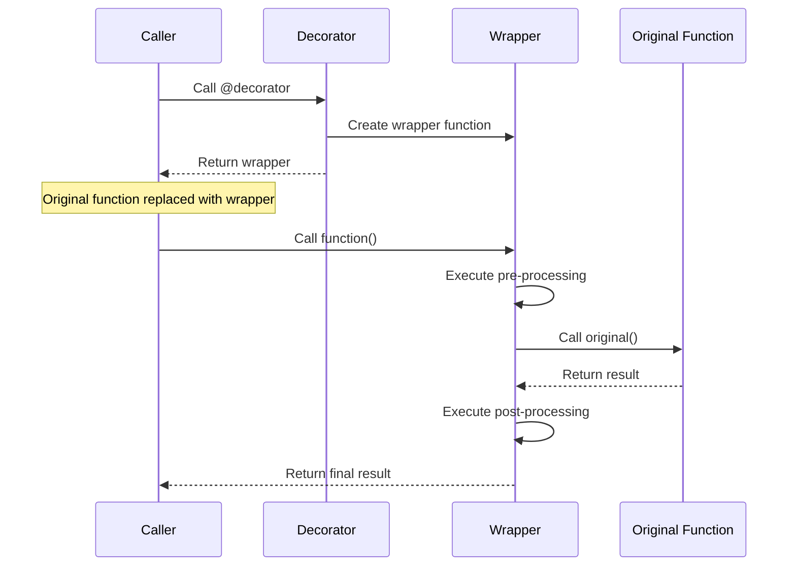
```mermaid
sequenceDiagram
    participant Caller
    participant Decorator
    participant Wrapper
    participant Original Function
    
    Caller->>Decorator: Call @decorator
    Decorator->>Wrapper: Create wrapper function
    Decorator-->>Caller: Return wrapper
    Note over Caller: Original function replaced with wrapper
    
    Caller->>Wrapper: Call function()
    Wrapper->>Wrapper: Execute pre-processing
    Wrapper->>Original Function: Call original()
    Original Function-->>Wrapper: Return result
    Wrapper->>Wrapper: Execute post-processing
    Wrapper-->>Caller: Return final result
```

### Basic Function Decorators

```python
import functools
import time
from typing import Callable, Any

# Simple decorator
def timer(func: Callable) -> Callable:
    """Measure execution time of a function."""
    @functools.wraps(func)  # Preserves original function metadata
    def wrapper(*args, **kwargs):
        start = time.perf_counter()
        result = func(*args, **kwargs)
        end = time.perf_counter()
        print(f"{func.__name__} took {end - start:.4f} seconds")
        return result
    return wrapper

@timer
def slow_function():
    time.sleep(1)
    return "Done"

# Usage
slow_function()  # Prints: slow_function took 1.0001 seconds
```

### Decorators with Arguments

```python
def repeat(times: int):
    """Decorator that repeats function execution."""
    def decorator(func: Callable) -> Callable:
        @functools.wraps(func)
        def wrapper(*args, **kwargs):
            results = []
            for _ in range(times):
                results.append(func(*args, **kwargs))
            return results
        return wrapper
    return decorator

@repeat(times=3)
def greet(name: str) -> str:
    return f"Hello, {name}!"

print(greet("Alice"))  # ['Hello, Alice!', 'Hello, Alice!', 'Hello, Alice!']
```

### Class-Based Decorators

```python
class CountCalls:
    """Decorator that counts function calls."""
    def __init__(self, func: Callable):
        functools.update_wrapper(self, func)
        self.func = func
        self.num_calls = 0
    
    def __call__(self, *args, **kwargs):
        self.num_calls += 1
        print(f"Call {self.num_calls} of {self.func.__name__}")
        return self.func(*args, **kwargs)

@CountCalls
def say_hello():
    return "Hello!"

say_hello()  # Call 1 of say_hello
say_hello()  # Call 2 of say_hello
print(say_hello.num_calls)  # 2
```

### Practical Decorator Examples

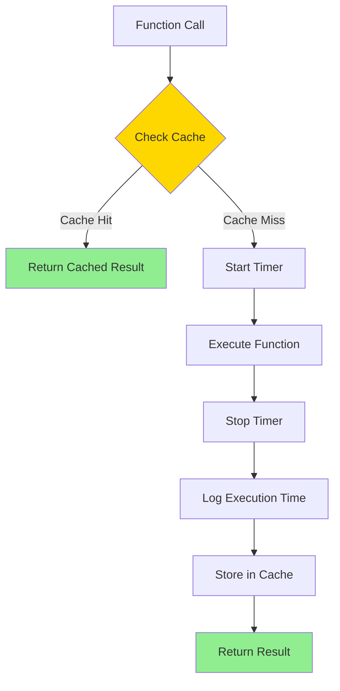
```mermaid
flowchart TD
    A[Function Call] --> B{Check Cache}
    B -->|Cache Hit| C[Return Cached Result]
    B -->|Cache Miss| D[Start Timer]
    D --> E[Execute Function]
    E --> F[Stop Timer]
    F --> G[Log Execution Time]
    G --> H[Store in Cache]
    H --> I[Return Result]
    
    style C fill:#90EE90
    style I fill:#90EE90
    style B fill:#FFD700
```

```python
from functools import lru_cache
from datetime import datetime, timedelta

# Caching decorator
@lru_cache(maxsize=128)
def fibonacci(n: int) -> int:
    """Cached Fibonacci calculation."""
    if n < 2:
        return n
    return fibonacci(n - 1) + fibonacci(n - 2)

# Retry decorator
def retry(max_attempts: int = 3, delay: float = 1.0):
    """Retry a function on exception."""
    def decorator(func: Callable) -> Callable:
        @functools.wraps(func)
        def wrapper(*args, **kwargs):
            for attempt in range(max_attempts):
                try:
                    return func(*args, **kwargs)
                except Exception as e:
                    if attempt == max_attempts - 1:
                        raise
                    print(f"Attempt {attempt + 1} failed: {e}. Retrying...")
                    time.sleep(delay)
        return wrapper
    return decorator

@retry(max_attempts=3, delay=0.5)
def unstable_api_call():
    import random
    if random.random() < 0.7:
        raise ConnectionError("Network error")
    return "Success"

# Rate limiting decorator
class RateLimiter:
    """Limit function calls to max_calls per period."""
    def __init__(self, max_calls: int, period: timedelta):
        self.max_calls = max_calls
        self.period = period
        self.calls = []
    
    def __call__(self, func: Callable) -> Callable:
        @functools.wraps(func)
        def wrapper(*args, **kwargs):
            now = datetime.now()
            # Remove old calls outside the time window
            self.calls = [call_time for call_time in self.calls 
                         if now - call_time < self.period]
            
            if len(self.calls) >= self.max_calls:
                raise Exception(f"Rate limit exceeded: {self.max_calls} calls per {self.period}")
            
            self.calls.append(now)
            return func(*args, **kwargs)
        return wrapper

@RateLimiter(max_calls=5, period=timedelta(seconds=10))
def api_endpoint():
    return "API response"

# Property decorators
class Temperature:
    """Temperature converter with validation."""
    def __init__(self, celsius: float = 0):
        self._celsius = celsius
    
    @property
    def celsius(self) -> float:
        return self._celsius
    
    @celsius.setter
    def celsius(self, value: float):
        if value < -273.15:
            raise ValueError("Temperature below absolute zero!")
        self._celsius = value
    
    @property
    def fahrenheit(self) -> float:
        return self._celsius * 9/5 + 32
    
    @fahrenheit.setter
    def fahrenheit(self, value: float):
        self.celsius = (value - 32) * 5/9

temp = Temperature(25)
print(temp.fahrenheit)  # 77.0
temp.fahrenheit = 86
print(temp.celsius)  # 30.0
```

### Method Decorators

```python
class MyClass:
    _class_var = "class level"
    
    def __init__(self, value):
        self.value = value
    
    # Instance method (default)
    def instance_method(self):
        return f"Instance: {self.value}"
    
    # Class method - receives class as first argument
    @classmethod
    def class_method(cls):
        return f"Class: {cls._class_var}"
    
    # Static method - no self or cls
    @staticmethod
    def static_method(x: int, y: int) -> int:
        return x + y
    
    # Combining decorators
    @property
    @lru_cache(maxsize=1)
    def expensive_property(self):
        print("Computing expensive property...")
        time.sleep(1)
        return self.value ** 2

obj = MyClass(5)
print(obj.instance_method())  # Instance: 5
print(MyClass.class_method())  # Class: class level
print(MyClass.static_method(3, 4))  # 7
print(obj.expensive_property)  # Computing... then 25
print(obj.expensive_property)  # 25 (cached, no computing)
```

---

## Generators & Iterators

Generators provide memory-efficient iteration by producing values lazily, one at a time, rather than storing entire sequences in memory.

### Basic Generators

```python
from typing import Generator, Iterator

# Generator function using yield
def countdown(n: int) -> Generator[int, None, None]:
    """Generate countdown from n to 1."""
    while n > 0:
        yield n
        n -= 1

# Usage
for num in countdown(5):
    print(num)  # 5, 4, 3, 2, 1

# Generator expressions (like list comprehensions but lazy)
squares_gen = (x**2 for x in range(1000000))  # No memory allocated yet
print(next(squares_gen))  # 0
print(next(squares_gen))  # 1
```

### Advanced Generator Patterns

```python
def fibonacci_generator() -> Generator[int, None, None]:
    """Infinite Fibonacci sequence."""
    a, b = 0, 1
    while True:
        yield a
        a, b = b, a + b

# Use with itertools for practical limits
import itertools

fib = fibonacci_generator()
first_10 = list(itertools.islice(fib, 10))
print(first_10)  # [0, 1, 1, 2, 3, 5, 8, 13, 21, 34]
```

### Generator Communication (send, throw, close)

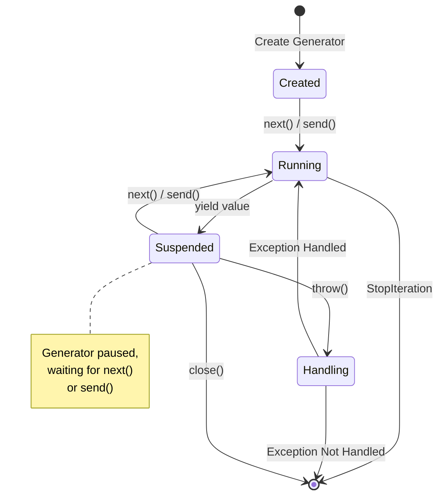
```mermaid
stateDiagram-v2
    [*] --> Created: Create Generator
    Created --> Running: next() / send()
    Running --> Suspended: yield value
    Suspended --> Running: next() / send()
    Running --> [*]: StopIteration
    Suspended --> Handling: throw()
    Handling --> Running: Exception Handled
    Handling --> [*]: Exception Not Handled
    Suspended --> [*]: close()
    
    note right of Suspended
        Generator paused,
        waiting for next()
        or send()
    end note
```

```python
def echo_generator() -> Generator[str, str, None]:
    """Generator that receives values via send()."""
    value = None
    while True:
        received = yield value
        if received is not None:
            value = f"Echo: {received}"

gen = echo_generator()
next(gen)  # Prime the generator
print(gen.send("Hello"))  # Echo: Hello
print(gen.send("World"))  # Echo: World

# Generator with exception handling
def resilient_generator() -> Generator[int, None, None]:
    """Generator that handles exceptions."""
    try:
        for i in range(10):
            yield i
    except GeneratorExit:
        print("Generator closed gracefully")
    except ValueError as e:
        print(f"Caught error: {e}")
        yield -1

gen = resilient_generator()
print(next(gen))  # 0
print(next(gen))  # 1
gen.throw(ValueError, "Something went wrong")  # Caught error: Something went wrong
print(next(gen))  # -1
gen.close()  # Generator closed gracefully
```

### Practical Generator Examples

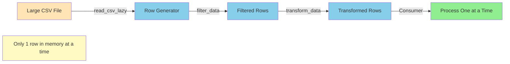
```mermaid
flowchart LR
    A[Large CSV File] -->|read_csv_lazy| B[Row Generator]
    B -->|filter_data| C[Filtered Rows]
    C -->|transform_data| D[Transformed Rows]
    D -->|Consumer| E[Process One at a Time]
    
    style A fill:#FFE4B5
    style B fill:#87CEEB
    style C fill:#87CEEB
    style D fill:#87CEEB
    style E fill:#90EE90
    
    Note1[Only 1 row in memory at a time]
    style Note1 fill:#FFF9C4
```

```python
import csv
from pathlib import Path

def read_large_file(filepath: Path, chunk_size: int = 8192) -> Generator[str, None, None]:
    """Read large file in chunks to avoid memory issues."""
    with open(filepath, 'r') as f:
        while True:
            chunk = f.read(chunk_size)
            if not chunk:
                break
            yield chunk

def parse_csv_lazy(filepath: Path) -> Generator[dict, None, None]:
    """Parse CSV file row by row (memory efficient)."""
    with open(filepath, 'r') as f:
        reader = csv.DictReader(f)
        for row in reader:
            yield row

# Pipeline pattern with generators
def filter_data(data_iter: Iterator[dict], condition: Callable) -> Generator[dict, None, None]:
    """Filter data based on condition."""
    for item in data_iter:
        if condition(item):
            yield item

def transform_data(data_iter: Iterator[dict], transform_fn: Callable) -> Generator[dict, None, None]:
    """Transform each data item."""
    for item in data_iter:
        yield transform_fn(item)

# Usage: Process large CSV with pipeline
# data = parse_csv_lazy('large_file.csv')
# filtered = filter_data(data, lambda x: int(x['age']) > 18)
# transformed = transform_data(filtered, lambda x: {**x, 'adult': True})
# for record in transformed:
#     process(record)  # Only one record in memory at a time
```

### Custom Iterators

```python
class RangeIterator:
    """Custom iterator implementing __iter__ and __next__."""
    def __init__(self, start: int, end: int, step: int = 1):
        self.current = start
        self.end = end
        self.step = step
    
    def __iter__(self):
        return self
    
    def __next__(self):
        if self.current >= self.end:
            raise StopIteration
        value = self.current
        self.current += self.step
        return value

# Usage
for num in RangeIterator(0, 10, 2):
    print(num)  # 0, 2, 4, 6, 8

# Iterable container with custom iteration
class ReversibleList:
    """List that can be iterated forward or backward."""
    def __init__(self, data: list):
        self.data = data
    
    def __iter__(self):
        return iter(self.data)
    
    def __reversed__(self):
        return iter(reversed(self.data))
    
    def __len__(self):
        return len(self.data)

rl = ReversibleList([1, 2, 3, 4, 5])
print(list(rl))  # [1, 2, 3, 4, 5]
print(list(reversed(rl)))  # [5, 4, 3, 2, 1]
```

### Generator-Based Coroutines (Pre-async/await)

```python
def moving_average() -> Generator[float, float, None]:
    """Calculate moving average using generator coroutine."""
    total = 0.0
    count = 0
    while True:
        value = yield total / count if count else 0
        total += value
        count += 1

avg = moving_average()
next(avg)  # Prime the generator
print(avg.send(10))  # 10.0
print(avg.send(20))  # 15.0
print(avg.send(30))  # 20.0
```

---

## Async/Await & Concurrency

Modern Python asynchronous programming using `async`/`await` for I/O-bound operations and concurrency patterns.

### Basic Async/Await

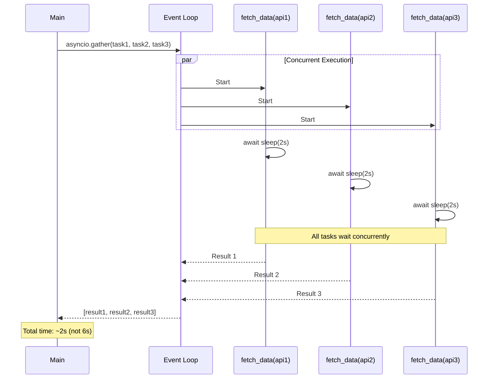
```mermaid
sequenceDiagram
    participant Main
    participant Event Loop
    participant Task1 as fetch_data(api1)
    participant Task2 as fetch_data(api2)
    participant Task3 as fetch_data(api3)
    
    Main->>Event Loop: asyncio.gather(task1, task2, task3)
    
    par Concurrent Execution
        Event Loop->>Task1: Start
        Event Loop->>Task2: Start
        Event Loop->>Task3: Start
    end
    
    Task1->>Task1: await sleep(2s)
    Task2->>Task2: await sleep(2s)
    Task3->>Task3: await sleep(2s)
    
    Note over Task1,Task3: All tasks wait concurrently
    
    Task1-->>Event Loop: Result 1
    Task2-->>Event Loop: Result 2
    Task3-->>Event Loop: Result 3
    
    Event Loop-->>Main: [result1, result2, result3]
    
    Note over Main: Total time: ~2s (not 6s)
```

```python
import asyncio
from typing import List

async def fetch_data(url: str, delay: float) -> dict:
    """Simulate async API call."""
    print(f"Fetching {url}...")
    await asyncio.sleep(delay)  # Simulates I/O wait
    return {"url": url, "data": f"Content from {url}"}

async def main():
    """Run multiple async operations concurrently."""
    # Sequential execution (slow)
    result1 = await fetch_data("http://api1.com", 2)
    result2 = await fetch_data("http://api2.com", 2)
    # Total time: ~4 seconds
    
    # Concurrent execution (fast)
    results = await asyncio.gather(
        fetch_data("http://api1.com", 2),
        fetch_data("http://api2.com", 2),
        fetch_data("http://api3.com", 2),
    )
    # Total time: ~2 seconds (all run in parallel)
    return results

# Run async code
if __name__ == "__main__":
    results = asyncio.run(main())
    print(results)
```

### Async Context Managers

```python
import aiofiles
from typing import AsyncIterator

class AsyncDatabaseConnection:
    """Async context manager for database connection."""
    def __init__(self, connection_string: str):
        self.connection_string = connection_string
        self.connection = None
    
    async def __aenter__(self):
        print("Opening database connection...")
        await asyncio.sleep(0.1)  # Simulate connection time
        self.connection = {"connected": True, "conn_str": self.connection_string}
        return self.connection
    
    async def __aexit__(self, exc_type, exc_val, exc_tb):
        print("Closing database connection...")
        await asyncio.sleep(0.1)  # Simulate cleanup
        self.connection = None
        return False  # Don't suppress exceptions

async def use_database():
    async with AsyncDatabaseConnection("postgresql://localhost/mydb") as conn:
        print(f"Connected: {conn}")
        # Use connection here
    print("Connection automatically closed")

# Async file operations
async def read_file_async(filepath: str) -> str:
    """Read file asynchronously."""
    async with aiofiles.open(filepath, 'r') as f:
        contents = await f.read()
    return contents
```

### Async Generators

```python
async def async_range(count: int) -> AsyncIterator[int]:
    """Async generator."""
    for i in range(count):
        await asyncio.sleep(0.1)
        yield i

async def consume_async_generator():
    """Iterate over async generator."""
    async for value in async_range(5):
        print(value)

# Async list comprehension
async def async_comprehension():
    results = [i async for i in async_range(5)]
    return results
```

### Async Patterns & Best Practices

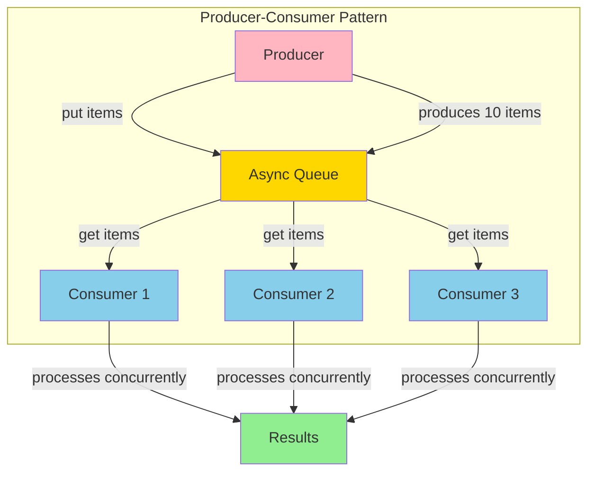
```mermaid
flowchart TB
    subgraph Producer-Consumer Pattern
        P[Producer] -->|put items| Q[Async Queue]
        Q -->|get items| C1[Consumer 1]
        Q -->|get items| C2[Consumer 2]
        Q -->|get items| C3[Consumer 3]
    end
    
    P -->|produces 10 items| Q
    C1 -->|processes concurrently| R[Results]
    C2 -->|processes concurrently| R
    C3 -->|processes concurrently| R
    
    style P fill:#FFB6C1
    style Q fill:#FFD700
    style C1 fill:#87CEEB
    style C2 fill:#87CEEB
    style C3 fill:#87CEEB
    style R fill:#90EE90
```

```python
from asyncio import Queue, Task, create_task
from typing import Optional

# Producer-Consumer pattern
async def producer(queue: Queue, n_items: int):
    """Produce items asynchronously."""
    for i in range(n_items):
        await asyncio.sleep(0.1)
        await queue.put(i)
        print(f"Produced: {i}")
    await queue.put(None)  # Sentinel to signal completion

async def consumer(queue: Queue, consumer_id: int):
    """Consume items asynchronously."""
    while True:
        item = await queue.get()
        if item is None:
            queue.task_done()
            break
        await asyncio.sleep(0.2)
        print(f"Consumer {consumer_id} processed: {item}")
        queue.task_done()

async def producer_consumer_demo():
    queue = Queue(maxsize=10)
    
    # Start producer and consumers
    tasks = [
        create_task(producer(queue, 10)),
        create_task(consumer(queue, 1)),
        create_task(consumer(queue, 2)),
    ]
    
    await asyncio.gather(*tasks)

# Timeout handling
async def fetch_with_timeout(url: str, timeout: float) -> Optional[dict]:
    """Fetch data with timeout."""
    try:
        async with asyncio.timeout(timeout):  # Python 3.11+
            return await fetch_data(url, 2)
    except asyncio.TimeoutError:
        print(f"Timeout fetching {url}")
        return None

# Task management
class TaskManager:
    """Manage background async tasks."""
    def __init__(self):
        self.tasks: List[Task] = []
    
    def create_task(self, coro) -> Task:
        """Create and track a task."""
        task = create_task(coro)
        self.tasks.append(task)
        task.add_done_callback(self.tasks.remove)
        return task
    
    async def shutdown(self):
        """Cancel all tasks and wait for cleanup."""
        for task in self.tasks:
            task.cancel()
        await asyncio.gather(*self.tasks, return_exceptions=True)

# Semaphore for rate limiting
async def rate_limited_fetch(urls: List[str], max_concurrent: int = 5):
    """Fetch URLs with concurrency limit."""
    semaphore = asyncio.Semaphore(max_concurrent)
    
    async def fetch_with_limit(url: str):
        async with semaphore:
            return await fetch_data(url, 1)
    
    return await asyncio.gather(*[fetch_with_limit(url) for url in urls])
```

### Threading vs Asyncio vs Multiprocessing

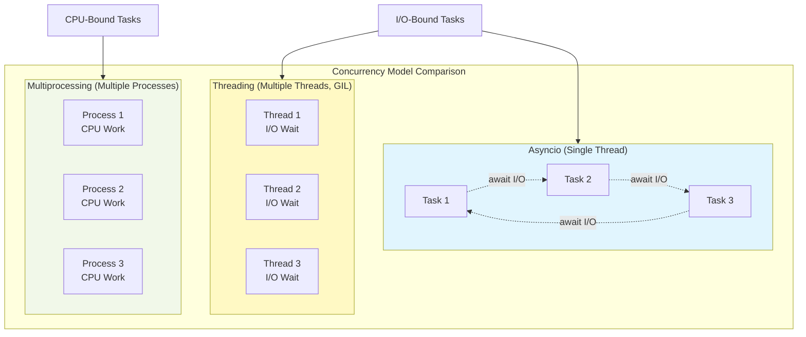
```mermaid
graph TB
    subgraph "Concurrency Model Comparison"
        subgraph Asyncio["Asyncio (Single Thread)"]
            A1[Task 1] -.await I/O.-> A2[Task 2]
            A2 -.await I/O.-> A3[Task 3]
            A3 -.await I/O.-> A1
        end
        
        subgraph Threading["Threading (Multiple Threads, GIL)"]
            T1[Thread 1<br/>I/O Wait]
            T2[Thread 2<br/>I/O Wait]
            T3[Thread 3<br/>I/O Wait]
        end
        
        subgraph Multiprocessing["Multiprocessing (Multiple Processes)"]
            P1[Process 1<br/>CPU Work]
            P2[Process 2<br/>CPU Work]
            P3[Process 3<br/>CPU Work]
        end
    end
    
    IO[I/O-Bound Tasks] --> Asyncio
    IO --> Threading
    CPU[CPU-Bound Tasks] --> Multiprocessing
    
    style Asyncio fill:#E1F5FE
    style Threading fill:#FFF9C4
    style Multiprocessing fill:#F1F8E9
```

```python
import threading
import multiprocessing
from concurrent.futures import ThreadPoolExecutor, ProcessPoolExecutor
import requests

# I/O-bound: Use asyncio or threading
async def io_bound_async():
    """Best for I/O-bound: async/await."""
    tasks = [fetch_data(f"http://api{i}.com", 1) for i in range(10)]
    return await asyncio.gather(*tasks)

def io_bound_threading():
    """Alternative for I/O-bound: threading."""
    def fetch(url):
        # Using synchronous library
        return requests.get(url, timeout=5)
    
    with ThreadPoolExecutor(max_workers=10) as executor:
        urls = [f"http://api{i}.com" for i in range(10)]
        results = list(executor.map(fetch, urls))
    return results

# CPU-bound: Use multiprocessing
def cpu_bound_task(n: int) -> int:
    """Expensive computation."""
    return sum(i*i for i in range(n))

def cpu_bound_multiprocessing():
    """Best for CPU-bound: multiprocessing."""
    with ProcessPoolExecutor(max_workers=4) as executor:
        numbers = [1000000] * 10
        results = list(executor.map(cpu_bound_task, numbers))
    return results

# When to use what:
# - Async/await: I/O-bound with async libraries (aiohttp, asyncpg)
# - Threading: I/O-bound with sync libraries (requests, psycopg2)
# - Multiprocessing: CPU-bound operations (computation, data processing)
```

### Async Best Practices

```python
# ✅ GOOD: Proper error handling
async def robust_fetch(url: str) -> Optional[dict]:
    """Fetch with proper error handling."""
    try:
        return await fetch_data(url, 2)
    except asyncio.CancelledError:
        print(f"Task cancelled for {url}")
        raise  # Re-raise CancelledError
    except Exception as e:
        print(f"Error fetching {url}: {e}")
        return None

# ✅ GOOD: Use create_task for fire-and-forget
async def background_processing():
    """Start background task without waiting."""
    task = asyncio.create_task(fetch_data("background", 5))
    # Do other work
    await asyncio.sleep(1)
    # Optionally await later
    result = await task
    return result

# ❌ BAD: Blocking call in async function
async def bad_async():
    time.sleep(1)  # Blocks entire event loop!
    return "done"

# ✅ GOOD: Run blocking code in executor
async def good_async():
    loop = asyncio.get_event_loop()
    result = await loop.run_in_executor(None, time.sleep, 1)
    return "done"

# ✅ GOOD: Structured concurrency with TaskGroup (Python 3.11+)
async def structured_concurrency():
    """All tasks complete or all fail together."""
    async with asyncio.TaskGroup() as tg:
        task1 = tg.create_task(fetch_data("url1", 1))
        task2 = tg.create_task(fetch_data("url2", 1))
        task3 = tg.create_task(fetch_data("url3", 1))
    
    # All tasks completed successfully if we reach here
    return [task1.result(), task2.result(), task3.result()]
```

---

## Context Managers

Context managers handle resource setup and teardown automatically using the `with` statement.

### Basic Context Managers

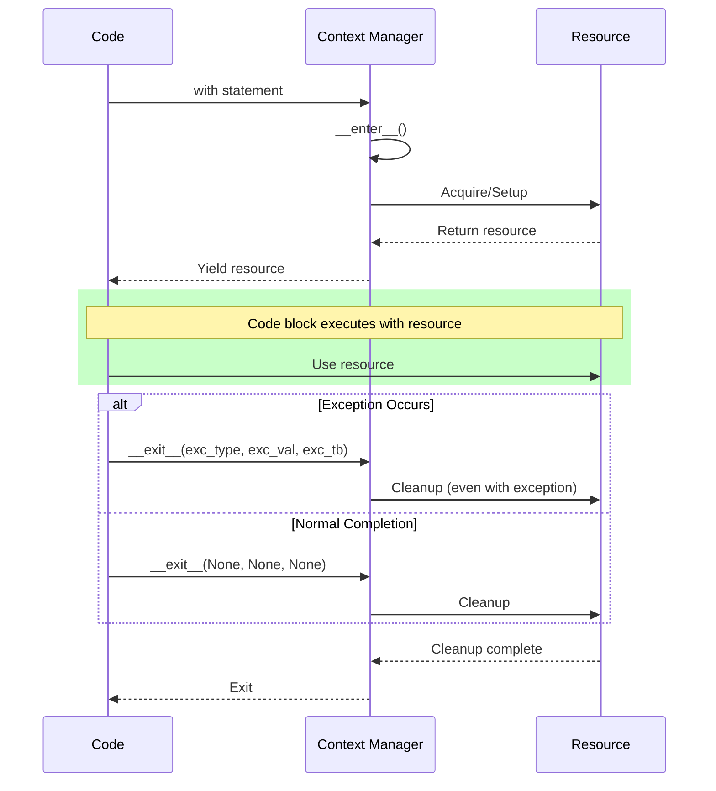
```mermaid
sequenceDiagram
    participant Code
    participant Context Manager
    participant Resource
    
    Code->>Context Manager: with statement
    Context Manager->>Context Manager: __enter__()
    Context Manager->>Resource: Acquire/Setup
    Resource-->>Context Manager: Return resource
    Context Manager-->>Code: Yield resource
    
    rect rgb(200, 255, 200)
        Note over Code,Resource: Code block executes with resource
        Code->>Resource: Use resource
    end
    
    alt Exception Occurs
        Code->>Context Manager: __exit__(exc_type, exc_val, exc_tb)
        Context Manager->>Resource: Cleanup (even with exception)
    else Normal Completion
        Code->>Context Manager: __exit__(None, None, None)
        Context Manager->>Resource: Cleanup
    end
    
    Resource-->>Context Manager: Cleanup complete
    Context Manager-->>Code: Exit
```

```python
from typing import TextIO

# Function-based context manager
from contextlib import contextmanager

@contextmanager
def open_file(filename: str, mode: str = 'r'):
    """Simple file context manager."""
    print(f"Opening {filename}")
    file = open(filename, mode)
    try:
        yield file
    finally:
        print(f"Closing {filename}")
        file.close()

# Usage
with open_file('test.txt', 'w') as f:
    f.write('Hello, World!')
# File automatically closed

# Class-based context manager
class DatabaseConnection:
    """Context manager for database connection."""
    def __init__(self, connection_string: str):
        self.connection_string = connection_string
        self.connection = None
    
    def __enter__(self):
        print(f"Connecting to {self.connection_string}")
        self.connection = {"connected": True}  # Simulated connection
        return self.connection
    
    def __exit__(self, exc_type, exc_val, exc_tb):
        print("Closing connection")
        if exc_type is not None:
            print(f"Exception occurred: {exc_type.__name__}: {exc_val}")
        self.connection = None
        return False  # Don't suppress exceptions

with DatabaseConnection("postgresql://localhost/mydb") as conn:
    print(f"Using connection: {conn}")
    # raise ValueError("Test error")  # Exception propagates after cleanup
```

### Advanced Context Manager Patterns

```python
import threading
from contextlib import contextmanager, suppress, ExitStack
from pathlib import Path

# Reusable context manager
class Timer:
    """Context manager to measure execution time."""
    def __init__(self, name: str = "Operation"):
        self.name = name
        self.elapsed = 0
    
    def __enter__(self):
        self.start = time.perf_counter()
        return self
    
    def __exit__(self, exc_type, exc_val, exc_tb):
        self.elapsed = time.perf_counter() - self.start
        print(f"{self.name} took {self.elapsed:.4f} seconds")
        return False

with Timer("Database query") as t:
    time.sleep(1)
print(f"Elapsed: {t.elapsed:.4f}s")

# Thread-safe lock context manager
class ThreadSafeCounter:
    """Counter with lock context manager."""
    def __init__(self):
        self._value = 0
        self._lock = threading.Lock()
    
    @contextmanager
    def lock(self):
        """Acquire lock for thread-safe operations."""
        self._lock.acquire()
        try:
            yield self
        finally:
            self._lock.release()
    
    def increment(self):
        with self.lock():
            self._value += 1
    
    @property
    def value(self):
        with self._lock:
            return self._value

# Suppress exceptions context manager
def safe_division(a: float, b: float) -> Optional[float]:
    """Divide with exception suppression."""
    with suppress(ZeroDivisionError, TypeError):
        return a / b
    return None

print(safe_division(10, 2))  # 5.0
print(safe_division(10, 0))  # None
print(safe_division(10, "x"))  # None

# Chaining context managers with ExitStack
def process_multiple_files(filenames: List[str]):
    """Open multiple files with dynamic count."""
    with ExitStack() as stack:
        files = [stack.enter_context(open(fname)) for fname in filenames]
        # All files opened, process them
        for f in files:
            content = f.read()
            # Process content
    # All files automatically closed
```

### Custom Context Managers for Resource Management

```python
class TemporaryDirectory:
    """Create and cleanup temporary directory."""
    def __init__(self, prefix: str = "tmp_"):
        self.prefix = prefix
        self.path = None
    
    def __enter__(self) -> Path:
        import tempfile
        self.path = Path(tempfile.mkdtemp(prefix=self.prefix))
        return self.path
    
    def __exit__(self, exc_type, exc_val, exc_tb):
        if self.path and self.path.exists():
            import shutil
            shutil.rmtree(self.path)
        return False

with TemporaryDirectory("test_") as tmp_dir:
    test_file = tmp_dir / "test.txt"
    test_file.write_text("temporary data")
    print(f"Created: {test_file}")
# Directory and all contents automatically deleted

# Atomic file writing
class AtomicWrite:
    """Write to temporary file, then rename on success."""
    def __init__(self, filepath: Path):
        self.filepath = filepath
        self.temp_path = filepath.with_suffix('.tmp')
        self.file = None
    
    def __enter__(self):
        self.file = open(self.temp_path, 'w')
        return self.file
    
    def __exit__(self, exc_type, exc_val, exc_tb):
        self.file.close()
        if exc_type is None:
            # Success: rename temp to target
            self.temp_path.rename(self.filepath)
        else:
            # Failure: remove temp file
            self.temp_path.unlink(missing_ok=True)
        return False

# Usage ensures file is only updated if write succeeds
with AtomicWrite(Path("config.json")) as f:
    f.write('{"setting": "value"}')
    # If exception occurs, original file unchanged
```

### Nested and Reentrant Context Managers

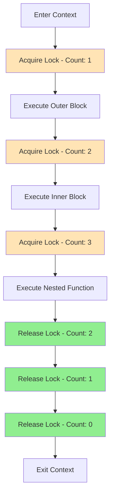
```mermaid
flowchart TD
    Start[Enter Context] --> Acquire1[Acquire Lock - Count: 1]
    Acquire1 --> Block1[Execute Outer Block]
    Block1 --> Acquire2[Acquire Lock - Count: 2]
    Acquire2 --> Block2[Execute Inner Block]
    Block2 --> Acquire3[Acquire Lock - Count: 3]
    Acquire3 --> Block3[Execute Nested Function]
    Block3 --> Release3[Release Lock - Count: 2]
    Release3 --> Release2[Release Lock - Count: 1]
    Release2 --> Release1[Release Lock - Count: 0]
    Release1 --> End[Exit Context]
    
    style Acquire1 fill:#FFE4B5
    style Acquire2 fill:#FFE4B5
    style Acquire3 fill:#FFE4B5
    style Release1 fill:#90EE90
    style Release2 fill:#90EE90
    style Release3 fill:#90EE90
```

```python
class ReentrantLock:
    """Lock that can be acquired multiple times by same thread."""
    def __init__(self):
        self._lock = threading.RLock()  # Reentrant lock
        self._count = 0
    
    def __enter__(self):
        self._lock.acquire()
        self._count += 1
        print(f"Lock acquired (count: {self._count})")
        return self
    
    def __exit__(self, exc_type, exc_val, exc_tb):
        self._count -= 1
        print(f"Lock released (count: {self._count})")
        self._lock.release()
        return False

lock = ReentrantLock()

def nested_function():
    with lock:
        print("In nested function")

with lock:
    print("In outer context")
    with lock:
        print("In inner context")
        nested_function()
# All lock acquisitions/releases balanced
```

---

## Performance Tuning

Techniques for profiling, optimizing, and measuring Python code performance.

### Profiling Code

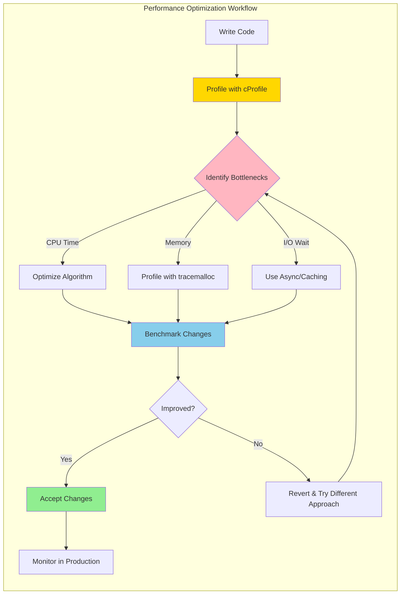
```mermaid
flowchart LR
    subgraph "Performance Optimization Workflow"
        A[Write Code] --> B[Profile with cProfile]
        B --> C{Identify Bottlenecks}
        C -->|CPU Time| D[Optimize Algorithm]
        C -->|Memory| E[Profile with tracemalloc]
        C -->|I/O Wait| F[Use Async/Caching]
        D --> G[Benchmark Changes]
        E --> G
        F --> G
        G --> H{Improved?}
        H -->|Yes| I[Accept Changes]
        H -->|No| J[Revert & Try Different Approach]
        J --> C
        I --> K[Monitor in Production]
    end
    
    style B fill:#FFD700
    style C fill:#FFB6C1
    style G fill:#87CEEB
    style I fill:#90EE90
```

```python
import cProfile
import pstats
from pstats import SortKey
from io import StringIO
import line_profiler

# Function profiling with cProfile
def profile_function(func, *args, **kwargs):
    """Profile a function and print stats."""
    profiler = cProfile.Profile()
    profiler.enable()
    result = func(*args, **kwargs)
    profiler.disable()
    
    # Print stats
    stats = pstats.Stats(profiler)
    stats.strip_dirs()
    stats.sort_stats(SortKey.CUMULATIVE)
    stats.print_stats(10)  # Top 10
    
    return result

def slow_function():
    """Example function to profile."""
    total = 0
    for i in range(1000000):
        total += i ** 2
    return total

# Profile it
result = profile_function(slow_function)

# Decorator for profiling
def profile(func):
    """Decorator to profile function."""
    @functools.wraps(func)
    def wrapper(*args, **kwargs):
        pr = cProfile.Profile()
        pr.enable()
        result = func(*args, **kwargs)
        pr.disable()
        
        s = StringIO()
        ps = pstats.Stats(pr, stream=s).sort_stats(SortKey.CUMULATIVE)
        ps.print_stats(20)
        print(s.getvalue())
        
        return result
    return wrapper

@profile
def my_function():
    return sum(x**2 for x in range(100000))
```

### Memory Profiling

```python
import tracemalloc
import sys
from typing import Any

def measure_memory(func):
    """Decorator to measure memory usage."""
    @functools.wraps(func)
    def wrapper(*args, **kwargs):
        tracemalloc.start()
        
        result = func(*args, **kwargs)
        
        current, peak = tracemalloc.get_traced_memory()
        tracemalloc.stop()
        
        print(f"\n{func.__name__} Memory Stats:")
        print(f"Current: {current / 1024 / 1024:.2f} MB")
        print(f"Peak: {peak / 1024 / 1024:.2f} MB")
        
        return result
    return wrapper

@measure_memory
def memory_intensive():
    """Create large data structures."""
    data = [x**2 for x in range(1000000)]
    return sum(data)

# Object size inspection
def get_size(obj: Any, seen=None) -> int:
    """Recursively calculate size of object."""
    size = sys.getsizeof(obj)
    if seen is None:
        seen = set()
    
    obj_id = id(obj)
    if obj_id in seen:
        return 0
    
    seen.add(obj_id)
    
    if isinstance(obj, dict):
        size += sum(get_size(k, seen) + get_size(v, seen) for k, v in obj.items())
    elif hasattr(obj, '__iter__') and not isinstance(obj, (str, bytes, bytearray)):
        size += sum(get_size(item, seen) for item in obj)
    
    return size

# Compare memory usage
list_data = [i for i in range(1000)]
generator_data = (i for i in range(1000))
print(f"List size: {sys.getsizeof(list_data)} bytes")
print(f"Generator size: {sys.getsizeof(generator_data)} bytes")
```

### Performance Optimization Techniques

```python
# 1. List comprehensions vs loops
import timeit

# Slower: for loop
def loop_version():
    result = []
    for i in range(1000):
        result.append(i ** 2)
    return result

# Faster: list comprehension
def comprehension_version():
    return [i ** 2 for i in range(1000)]

print("Loop:", timeit.timeit(loop_version, number=10000))
print("Comprehension:", timeit.timeit(comprehension_version, number=10000))

# 2. Use built-in functions (implemented in C)
# Faster
def builtin_sum():
    return sum(range(1000))

# Slower
def manual_sum():
    total = 0
    for i in range(1000):
        total += i
    return total

# 3. Use local variables (faster lookup)
def with_global():
    for _ in range(1000):
        x = len([1, 2, 3])  # Global lookup

def with_local():
    local_len = len  # Cache global
    for _ in range(1000):
        x = local_len([1, 2, 3])

# 4. Avoid repeated attribute access
class MyClass:
    def __init__(self):
        self.data = list(range(1000))

def repeated_access():
    obj = MyClass()
    total = 0
    for i in range(1000):
        total += obj.data[i]  # Repeated attribute lookup

def cached_access():
    obj = MyClass()
    data = obj.data  # Cache attribute
    total = 0
    for i in range(1000):
        total += data[i]

# 5. Use __slots__ for memory efficiency
class WithoutSlots:
    """Regular class with __dict__."""
    def __init__(self, x, y):
        self.x = x
        self.y = y

class WithSlots:
    """Memory-efficient class."""
    __slots__ = ['x', 'y']
    
    def __init__(self, x, y):
        self.x = x
        self.y = y

# WithSlots uses ~40% less memory per instance

# 6. Use generators for large datasets
def process_large_file_bad(filename):
    """Loads entire file into memory."""
    with open(filename) as f:
        return [line.strip() for line in f]

def process_large_file_good(filename):
    """Streams file line by line."""
    with open(filename) as f:
        for line in f:
            yield line.strip()
```

### Caching Strategies

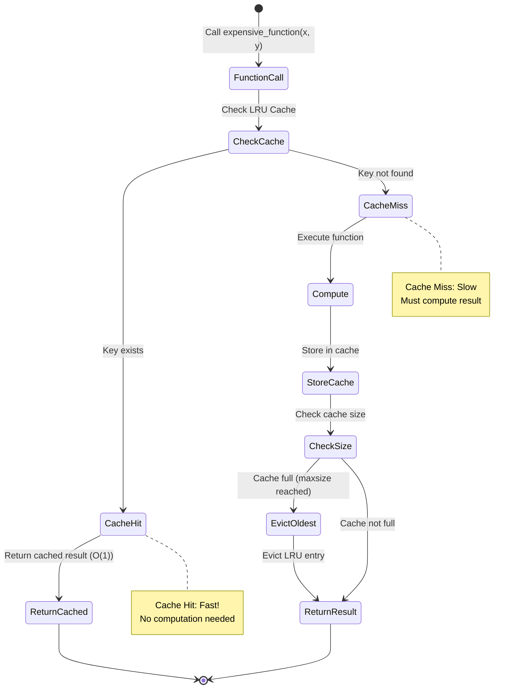
```mermaid
stateDiagram-v2
    [*] --> FunctionCall: Call expensive_function(x, y)
    FunctionCall --> CheckCache: Check LRU Cache
    
    state CheckCache <<choice>>
    CheckCache --> CacheHit: Key exists
    CheckCache --> CacheMiss: Key not found
    
    CacheHit --> ReturnCached: Return cached result (O(1))
    CacheMiss --> Compute: Execute function
    Compute --> StoreCache: Store in cache
    StoreCache --> CheckSize: Check cache size
    
    state CheckSize <<choice>>
    CheckSize --> EvictOldest: Cache full (maxsize reached)
    CheckSize --> ReturnResult: Cache not full
    
    EvictOldest --> ReturnResult: Evict LRU entry
    ReturnCached --> [*]
    ReturnResult --> [*]
    
    note right of CacheHit
        Cache Hit: Fast!
        No computation needed
    end note
    
    note right of CacheMiss
        Cache Miss: Slow
        Must compute result
    end note
```

```python
from functools import lru_cache, cache
from typing import Dict, Tuple

# Simple memoization
@lru_cache(maxsize=128)
def fibonacci(n: int) -> int:
    """Cached Fibonacci (exponential to linear time)."""
    if n < 2:
        return n
    return fibonacci(n - 1) + fibonacci(n - 2)

print(fibonacci(100))  # Fast due to caching
print(fibonacci.cache_info())  # View cache stats

# Unbounded cache (Python 3.9+)
@cache
def expensive_computation(x: int, y: int) -> int:
    """Unlimited cache."""
    time.sleep(1)  # Simulate expensive operation
    return x ** y

# Custom cache with TTL
import time as time_module

class TTLCache:
    """Time-based cache decorator."""
    def __init__(self, ttl_seconds: float):
        self.ttl_seconds = ttl_seconds
        self.cache: Dict[Tuple, Tuple[float, Any]] = {}
    
    def __call__(self, func):
        @functools.wraps(func)
        def wrapper(*args, **kwargs):
            key = (args, tuple(kwargs.items()))
            now = time_module.time()
            
            if key in self.cache:
                timestamp, value = self.cache[key]
                if now - timestamp < self.ttl_seconds:
                    return value
            
            result = func(*args, **kwargs)
            self.cache[key] = (now, result)
            return result
        
        return wrapper

@TTLCache(ttl_seconds=5.0)
def get_data(key: str) -> str:
    """Cached for 5 seconds."""
    print("Fetching data...")
    return f"Data for {key}"

print(get_data("test"))  # Fetching data...
print(get_data("test"))  # Cached
time.sleep(6)
print(get_data("test"))  # Fetching data... (cache expired)
```

### Benchmarking Best Practices

```python
import timeit
from typing import Callable

def benchmark(func: Callable, *args, number: int = 1000, **kwargs):
    """Benchmark a function."""
    def wrapper():
        return func(*args, **kwargs)
    
    time_taken = timeit.timeit(wrapper, number=number)
    avg_time = time_taken / number
    
    print(f"\n{func.__name__} Benchmark:")
    print(f"Total time: {time_taken:.6f}s")
    print(f"Average per call: {avg_time * 1000:.6f}ms")
    print(f"Calls per second: {number / time_taken:.0f}")

# Compare implementations
def compare_implementations(*funcs, number=1000):
    """Compare multiple implementations."""
    results = []
    for func in funcs:
        time_taken = timeit.timeit(func, number=number)
        results.append((func.__name__, time_taken))
    
    # Sort by time
    results.sort(key=lambda x: x[1])
    
    print("\nPerformance Comparison:")
    fastest = results[0][1]
    for name, time_taken in results:
        ratio = time_taken / fastest
        print(f"{name:30} {time_taken:.6f}s  ({ratio:.2f}x)")

# Example usage
def method1():
    return [x**2 for x in range(100)]

def method2():
    return list(map(lambda x: x**2, range(100)))

def method3():
    result = []
    for x in range(100):
        result.append(x**2)
    return result

compare_implementations(method1, method2, method3, number=10000)
```

---

## Type Hints & Pydantic

Modern Python type annotations for better code quality, IDE support, and runtime validation.

### Basic Type Hints

```python
from typing import (
    List, Dict, Set, Tuple, Optional, Union, Any,
    Callable, Iterable, Sequence, Mapping
)

# Primitive types
def greet(name: str, age: int) -> str:
    """Type hints for function parameters and return value."""
    return f"Hello {name}, you are {age} years old"

# Collection types
def process_numbers(numbers: List[int]) -> Dict[str, int]:
    """Type hints for collections."""
    return {
        "sum": sum(numbers),
        "count": len(numbers),
        "max": max(numbers),
    }

# Optional values (can be None)
def find_user(user_id: int) -> Optional[Dict[str, Any]]:
    """Return user dict or None if not found."""
    if user_id > 0:
        return {"id": user_id, "name": "Alice"}
    return None

# Union types (multiple possible types)
def process_input(data: Union[str, int, List[str]]) -> str:
    """Accept multiple types."""
    if isinstance(data, str):
        return data.upper()
    elif isinstance(data, int):
        return str(data)
    else:
        return ", ".join(data)

# Callable type hints
def apply_operation(
    value: int,
    operation: Callable[[int], int]
) -> int:
    """Function that accepts another function."""
    return operation(value)

result = apply_operation(5, lambda x: x ** 2)  # 25

# Generic iterables
def process_items(items: Iterable[str]) -> List[str]:
    """Works with any iterable of strings."""
    return [item.upper() for item in items]
```

### Advanced Type Hints

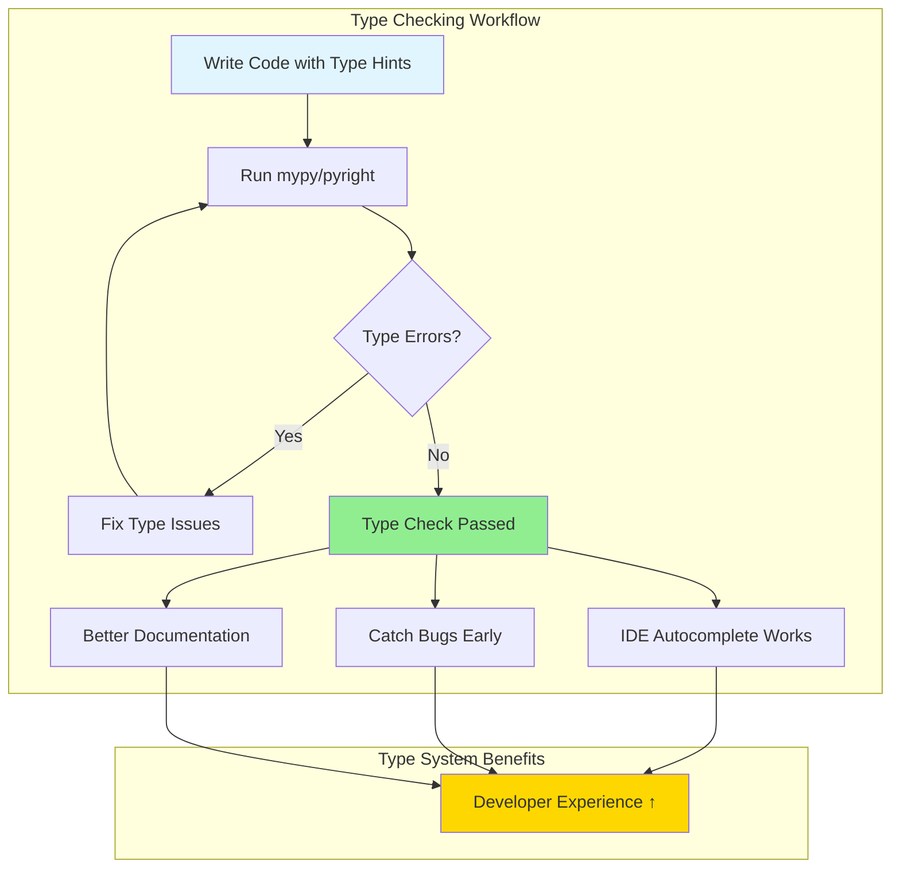
```mermaid
flowchart TB
    subgraph "Type Checking Workflow"
        A[Write Code with Type Hints] --> B[Run mypy/pyright]
        B --> C{Type Errors?}
        C -->|Yes| D[Fix Type Issues]
        C -->|No| E[Type Check Passed]
        D --> B
        E --> F[IDE Autocomplete Works]
        E --> G[Catch Bugs Early]
        E --> H[Better Documentation]
    end
    
    subgraph "Type System Benefits"
        F --> I[Developer Experience ↑]
        G --> I
        H --> I
    end
    
    style A fill:#E1F5FE
    style E fill:#90EE90
    style I fill:#FFD700
```

```python
from typing import (
    TypeVar, Generic, Protocol, Literal, Final,
    TypedDict, NewType, overload, cast
)

# TypeVar for generic functions
T = TypeVar('T')

def first_element(items: List[T]) -> Optional[T]:
    """Return first element, preserving type."""
    return items[0] if items else None

result: Optional[int] = first_element([1, 2, 3])  # Type: Optional[int]

# Generic classes
class Stack(Generic[T]):
    """Type-safe stack implementation."""
    def __init__(self):
        self._items: List[T] = []
    
    def push(self, item: T) -> None:
        self._items.append(item)
    
    def pop(self) -> T:
        return self._items.pop()
    
    def peek(self) -> Optional[T]:
        return self._items[-1] if self._items else None

int_stack: Stack[int] = Stack()
int_stack.push(42)
# int_stack.push("hello")  # Type checker error!

# Protocol for structural typing (duck typing)
class Drawable(Protocol):
    """Protocol defining drawable interface."""
    def draw(self) -> None:
        ...

class Circle:
    """Implements Drawable protocol."""
    def draw(self) -> None:
        print("Drawing circle")

class Square:
    """Also implements Drawable protocol."""
    def draw(self) -> None:
        print("Drawing square")

def render(shape: Drawable) -> None:
    """Accepts anything with a draw() method."""
    shape.draw()

# Literal types for specific values
def set_mode(mode: Literal["read", "write", "append"]) -> None:
    """Only accepts specific string values."""
    print(f"Mode: {mode}")

set_mode("read")  # OK
# set_mode("delete")  # Type checker error!

# Final for constants
MAX_CONNECTIONS: Final[int] = 100
# MAX_CONNECTIONS = 200  # Type checker error!

# TypedDict for structured dictionaries
class UserDict(TypedDict):
    """Typed dictionary structure."""
    id: int
    name: str
    email: str
    active: bool

def create_user(user_data: UserDict) -> UserDict:
    """Type-safe dictionary handling."""
    return user_data

user: UserDict = {
    "id": 1,
    "name": "Alice",
    "email": "alice@example.com",
    "active": True,
}

# NewType for distinct types
UserId = NewType('UserId', int)
ProductId = NewType('ProductId', int)

def get_user(user_id: UserId) -> str:
    return f"User {user_id}"

def get_product(product_id: ProductId) -> str:
    return f"Product {product_id}"

uid = UserId(42)
pid = ProductId(100)

# get_user(pid)  # Type checker catches this error!

# Function overloading
@overload
def process(data: int) -> str:
    ...

@overload
def process(data: str) -> int:
    ...

def process(data: Union[int, str]) -> Union[str, int]:
    """Different return types based on input."""
    if isinstance(data, int):
        return str(data)
    return len(data)
```

### Pydantic Models

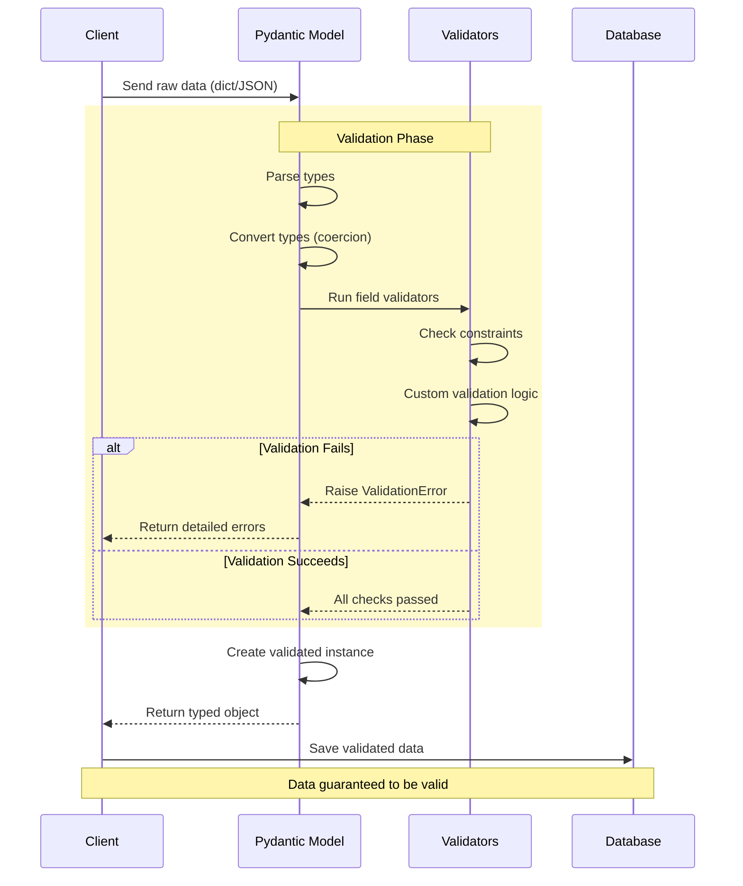
```mermaid
sequenceDiagram
    participant Client
    participant Pydantic Model
    participant Validators
    participant Database
    
    Client->>Pydantic Model: Send raw data (dict/JSON)
    
    rect rgb(255, 250, 205)
        Note over Pydantic Model,Validators: Validation Phase
        Pydantic Model->>Pydantic Model: Parse types
        Pydantic Model->>Pydantic Model: Convert types (coercion)
        Pydantic Model->>Validators: Run field validators
        Validators->>Validators: Check constraints
        Validators->>Validators: Custom validation logic
        
        alt Validation Fails
            Validators-->>Pydantic Model: Raise ValidationError
            Pydantic Model-->>Client: Return detailed errors
        else Validation Succeeds
            Validators-->>Pydantic Model: All checks passed
        end
    end
    
    Pydantic Model->>Pydantic Model: Create validated instance
    Pydantic Model-->>Client: Return typed object
    Client->>Database: Save validated data
    
    Note over Client,Database: Data guaranteed to be valid
```

```python
from pydantic import BaseModel, Field, validator, root_validator
from pydantic import EmailStr, HttpUrl, constr, conint
from datetime import datetime
from typing import List, Optional

# Basic Pydantic model
class User(BaseModel):
    """User model with validation."""
    id: int
    name: str = Field(..., min_length=1, max_length=100)
    email: EmailStr
    age: Optional[int] = Field(None, ge=0, le=150)
    is_active: bool = True
    created_at: datetime = Field(default_factory=datetime.now)
    
    class Config:
        # Configuration options
        validate_assignment = True  # Validate on attribute assignment
        str_strip_whitespace = True  # Strip whitespace from strings

# Usage
user = User(
    id=1,
    name="Alice",
    email="alice@example.com",
    age=30,
)

print(user.dict())  # Convert to dict
print(user.json())  # Convert to JSON

# Validation errors
try:
    invalid_user = User(
        id=1,
        name="",  # Too short
        email="invalid-email",  # Invalid email
        age=200,  # Too old
    )
except Exception as e:
    print(e)

# Custom validators
class Product(BaseModel):
    """Product with custom validation."""
    name: str
    price: float
    quantity: int
    
    @validator('price')
    def price_must_be_positive(cls, v):
        """Validate price is positive."""
        if v <= 0:
            raise ValueError('Price must be positive')
        return v
    
    @validator('name')
    def name_must_not_contain_special_chars(cls, v):
        """Validate name format."""
        if not v.replace(' ', '').isalnum():
            raise ValueError('Name must be alphanumeric')
        return v.title()  # Capitalize
    
    @root_validator
    def check_stock_value(cls, values):
        """Validate across multiple fields."""
        price = values.get('price', 0)
        quantity = values.get('quantity', 0)
        total_value = price * quantity
        
        if total_value > 100000:
            raise ValueError('Total stock value exceeds limit')
        return values

product = Product(name="laptop", price=999.99, quantity=50)
print(product.name)  # Laptop (capitalized)

# Nested models
class Address(BaseModel):
    """Nested address model."""
    street: str
    city: str
    country: str
    postal_code: str

class Company(BaseModel):
    """Company with nested address."""
    name: str
    address: Address
    employees: List[User]
    website: HttpUrl

company_data = {
    "name": "Tech Corp",
    "address": {
        "street": "123 Main St",
        "city": "San Francisco",
        "country": "USA",
        "postal_code": "94102",
    },
    "employees": [
        {"id": 1, "name": "Alice", "email": "alice@techcorp.com"},
        {"id": 2, "name": "Bob", "email": "bob@techcorp.com"},
    ],
    "website": "https://techcorp.com",
}

company = Company(**company_data)
print(company.address.city)  # San Francisco
```

### Advanced Pydantic Patterns

```python
from pydantic import BaseModel, Field, validator
from enum import Enum
from typing import Union

# Enums in models
class UserRole(str, Enum):
    """User role enumeration."""
    ADMIN = "admin"
    USER = "user"
    GUEST = "guest"

class UserWithRole(BaseModel):
    """User with role enum."""
    name: str
    role: UserRole = UserRole.USER

user = UserWithRole(name="Alice", role="admin")
print(user.role == UserRole.ADMIN)  # True

# Discriminated unions
class Cat(BaseModel):
    """Cat model."""
    pet_type: Literal["cat"]
    meow: str

class Dog(BaseModel):
    """Dog model."""
    pet_type: Literal["dog"]
    bark: str

class Pet(BaseModel):
    """Union of pets with discriminator."""
    __root__: Union[Cat, Dog] = Field(..., discriminator='pet_type')

cat_data = {"pet_type": "cat", "meow": "meow"}
dog_data = {"pet_type": "dog", "bark": "woof"}

# Immutable models
class ImmutableUser(BaseModel):
    """Immutable user model."""
    name: str
    email: str
    
    class Config:
        frozen = True  # Make immutable

immutable = ImmutableUser(name="Alice", email="alice@example.com")
# immutable.name = "Bob"  # Raises ValidationError

# ORM mode (for SQLAlchemy models)
class ORMUser(BaseModel):
    """Model that can read from ORM objects."""
    id: int
    name: str
    email: str
    
    class Config:
        orm_mode = True  # Enable ORM mode

# Can now initialize from SQLAlchemy model:
# db_user = session.query(DBUser).first()
# pydantic_user = ORMUser.from_orm(db_user)

# Field aliases
class APIResponse(BaseModel):
    """Model with field aliasing."""
    user_id: int = Field(..., alias="userId")
    user_name: str = Field(..., alias="userName")
    
    class Config:
        allow_population_by_field_name = True  # Allow both names

# Works with both:
response1 = APIResponse(userId=1, userName="Alice")
response2 = APIResponse(user_id=1, user_name="Alice")
```

### Pydantic Settings Management

```python
from pydantic import BaseSettings, PostgresDsn, RedisDsn
from typing import Optional

class Settings(BaseSettings):
    """Application settings from environment variables."""
    app_name: str = "MyApp"
    debug: bool = False
    
    # Database
    database_url: PostgresDsn
    
    # Redis
    redis_url: Optional[RedisDsn] = None
    
    # API Keys
    api_key: str
    secret_key: str
    
    # Computed fields
    @property
    def is_production(self) -> bool:
        return not self.debug
    
    class Config:
        env_file = ".env"  # Read from .env file
        env_file_encoding = "utf-8"
        case_sensitive = False  # Environment variables case-insensitive

# Automatically reads from environment or .env file
# settings = Settings()
# print(settings.database_url)
# print(settings.is_production)
```

---

## Dependency Injection

Design pattern for managing dependencies and improving testability.

### Basic Dependency Injection

```python
from typing import Protocol, Dict, Any
from abc import ABC, abstractmethod

# Define interfaces (protocols)
class DatabaseInterface(Protocol):
    """Database interface."""
    def get(self, key: str) -> Optional[Dict[str, Any]]:
        ...
    
    def save(self, key: str, value: Dict[str, Any]) -> None:
        ...

class CacheInterface(Protocol):
    """Cache interface."""
    def get(self, key: str) -> Optional[Any]:
        ...
    
    def set(self, key: str, value: Any, ttl: int = 3600) -> None:
        ...

# Implementations
class PostgresDatabase:
    """Postgres implementation."""
    def __init__(self, connection_string: str):
        self.connection_string = connection_string
        print(f"Connected to Postgres: {connection_string}")
    
    def get(self, key: str) -> Optional[Dict[str, Any]]:
        return {"id": key, "data": "from postgres"}
    
    def save(self, key: str, value: Dict[str, Any]) -> None:
        print(f"Saved to Postgres: {key} = {value}")

class RedisCache:
    """Redis cache implementation."""
    def __init__(self, host: str, port: int):
        self.host = host
        self.port = port
        print(f"Connected to Redis: {host}:{port}")
    
    def get(self, key: str) -> Optional[Any]:
        return f"cached_{key}"
    
    def set(self, key: str, value: Any, ttl: int = 3600) -> None:
        print(f"Cached: {key} = {value} (TTL: {ttl}s)")

# Service with dependency injection
class UserService:
    """User service with injected dependencies."""
    def __init__(
        self,
        database: DatabaseInterface,
        cache: CacheInterface,
    ):
        self.database = database
        self.cache = cache
    
    def get_user(self, user_id: str) -> Optional[Dict[str, Any]]:
        """Get user with caching."""
        # Try cache first
        cached = self.cache.get(f"user:{user_id}")
        if cached:
            return cached
        
        # Fall back to database
        user = self.database.get(user_id)
        if user:
            self.cache.set(f"user:{user_id}", user)
        
        return user
    
    def save_user(self, user_id: str, user_data: Dict[str, Any]) -> None:
        """Save user to database and cache."""
        self.database.save(user_id, user_data)
        self.cache.set(f"user:{user_id}", user_data)

# Manual dependency injection
database = PostgresDatabase("postgresql://localhost/mydb")
cache = RedisCache("localhost", 6379)
user_service = UserService(database=database, cache=cache)

user = user_service.get_user("123")
```

### Dependency Injection Container

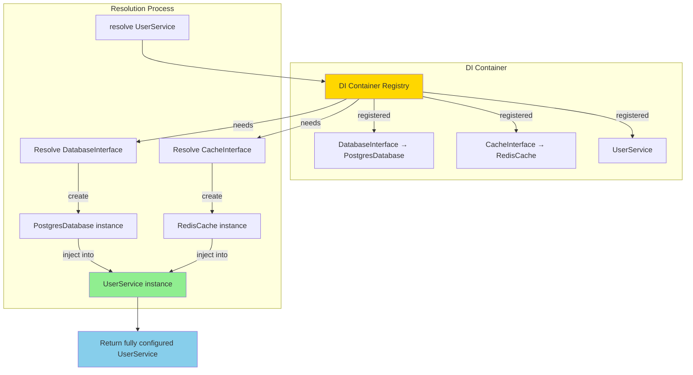
```mermaid
graph TB
    subgraph "DI Container"
        Container[DI Container Registry]
        Container -->|registered| DB[DatabaseInterface → PostgresDatabase]
        Container -->|registered| Cache[CacheInterface → RedisCache]
        Container -->|registered| Service[UserService]
    end
    
    subgraph "Resolution Process"
        Request[resolve UserService] --> Container
        Container -->|needs| ResolveDB[Resolve DatabaseInterface]
        Container -->|needs| ResolveCache[Resolve CacheInterface]
        
        ResolveDB -->|create| DBInstance[PostgresDatabase instance]
        ResolveCache -->|create| CacheInstance[RedisCache instance]
        
        DBInstance -->|inject into| ServiceInstance[UserService instance]
        CacheInstance -->|inject into| ServiceInstance
    end
    
    ServiceInstance --> Return[Return fully configured UserService]
    
    style Container fill:#FFD700
    style ServiceInstance fill:#90EE90
    style Return fill:#87CEEB
```

```python
from typing import Type, Callable, Any
import inspect

class DIContainer:
    """Simple dependency injection container."""
    def __init__(self):
        self._services: Dict[Type, Callable] = {}
        self._singletons: Dict[Type, Any] = {}
    
    def register(
        self,
        interface: Type,
        implementation: Callable,
        singleton: bool = True,
    ):
        """Register a service."""
        self._services[interface] = implementation
        if singleton:
            self._singletons[interface] = None
    
    def resolve(self, interface: Type) -> Any:
        """Resolve a service with automatic dependency injection."""
        # Return singleton if exists
        if interface in self._singletons:
            if self._singletons[interface] is not None:
                return self._singletons[interface]
        
        # Get implementation
        if interface not in self._services:
            raise ValueError(f"Service {interface} not registered")
        
        implementation = self._services[interface]
        
        # Auto-inject dependencies
        sig = inspect.signature(implementation)
        kwargs = {}
        
        for param_name, param in sig.parameters.items():
            if param.annotation != inspect.Parameter.empty:
                # Recursively resolve dependencies
                kwargs[param_name] = self.resolve(param.annotation)
        
        # Create instance
        instance = implementation(**kwargs)
        
        # Store singleton
        if interface in self._singletons:
            self._singletons[interface] = instance
        
        return instance

# Usage
container = DIContainer()

# Register services
container.register(DatabaseInterface, PostgresDatabase)
container.register(CacheInterface, RedisCache)
container.register(UserService, UserService)

# Resolve with automatic dependency injection
user_service = container.resolve(UserService)
# All dependencies automatically injected!
```

### Factory Pattern for Dependencies

```python
class DatabaseFactory:
    """Factory for creating database instances."""
    @staticmethod
    def create(db_type: str, **config) -> DatabaseInterface:
        """Create database based on type."""
        if db_type == "postgres":
            return PostgresDatabase(config["connection_string"])
        elif db_type == "mongodb":
            return MongoDatabase(config["connection_string"])
        else:
            raise ValueError(f"Unknown database type: {db_type}")

class CacheFactory:
    """Factory for creating cache instances."""
    @staticmethod
    def create(cache_type: str, **config) -> CacheInterface:
        """Create cache based on type."""
        if cache_type == "redis":
            return RedisCache(config["host"], config["port"])
        elif cache_type == "memcached":
            return MemcachedCache(config["servers"])
        else:
            raise ValueError(f"Unknown cache type: {cache_type}")

# Configuration-driven initialization
def create_user_service(config: Dict[str, Any]) -> UserService:
    """Create user service from configuration."""
    database = DatabaseFactory.create(
        config["database"]["type"],
        **config["database"]["config"]
    )
    
    cache = CacheFactory.create(
        config["cache"]["type"],
        **config["cache"]["config"]
    )
    
    return UserService(database=database, cache=cache)

config = {
    "database": {
        "type": "postgres",
        "config": {"connection_string": "postgresql://localhost/mydb"}
    },
    "cache": {
        "type": "redis",
        "config": {"host": "localhost", "port": 6379}
    }
}

service = create_user_service(config)
```

### Testing with Dependency Injection

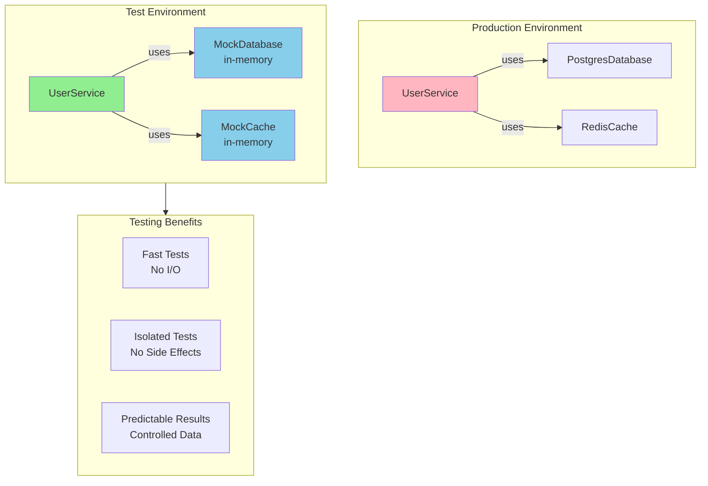
```mermaid
flowchart TB
    subgraph Production["Production Environment"]
        ProdService[UserService]
        ProdDB[PostgresDatabase]
        ProdCache[RedisCache]
        
        ProdService -->|uses| ProdDB
        ProdService -->|uses| ProdCache
    end
    
    subgraph Testing["Test Environment"]
        TestService[UserService]
        MockDB[MockDatabase<br/>in-memory]
        MockCache[MockCache<br/>in-memory]
        
        TestService -->|uses| MockDB
        TestService -->|uses| MockCache
    end
    
    subgraph Benefits["Testing Benefits"]
        Fast[Fast Tests<br/>No I/O]
        Isolated[Isolated Tests<br/>No Side Effects]
        Predictable[Predictable Results<br/>Controlled Data]
    end
    
    Testing --> Benefits
    
    style ProdService fill:#FFB6C1
    style TestService fill:#90EE90
    style MockDB fill:#87CEEB
    style MockCache fill:#87CEEB
```

```python
# Mock implementations for testing
class MockDatabase:
    """Mock database for testing."""
    def __init__(self):
        self.data: Dict[str, Dict[str, Any]] = {}
    
    def get(self, key: str) -> Optional[Dict[str, Any]]:
        return self.data.get(key)
    
    def save(self, key: str, value: Dict[str, Any]) -> None:
        self.data[key] = value

class MockCache:
    """Mock cache for testing."""
    def __init__(self):
        self.data: Dict[str, Any] = {}
    
    def get(self, key: str) -> Optional[Any]:
        return self.data.get(key)
    
    def set(self, key: str, value: Any, ttl: int = 3600) -> None:
        self.data[key] = value

# Test with mocks
def test_user_service():
    """Test user service with mock dependencies."""
    # Inject mocks
    mock_db = MockDatabase()
    mock_cache = MockCache()
    service = UserService(database=mock_db, cache=mock_cache)
    
    # Test save
    user_data = {"name": "Alice", "email": "alice@example.com"}
    service.save_user("123", user_data)
    
    # Verify saved to both
    assert mock_db.data["123"] == user_data
    assert mock_cache.data["user:123"] == user_data
    
    # Test get from cache
    user = service.get_user("123")
    assert user == user_data

test_user_service()
print("All tests passed!")
```

---

## FastAPI Architecture

Building production-ready APIs with FastAPI, Pydantic, and modern Python patterns.

### Basic FastAPI Application

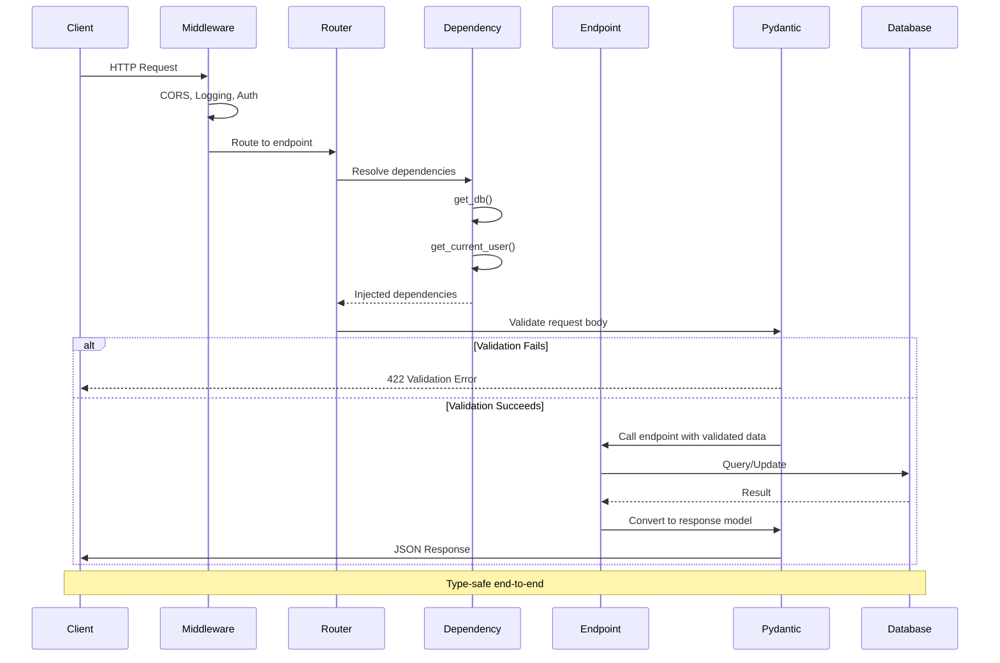
```mermaid
sequenceDiagram
    participant Client
    participant Middleware
    participant Router
    participant Dependency
    participant Endpoint
    participant Pydantic
    participant Database
    
    Client->>Middleware: HTTP Request
    Middleware->>Middleware: CORS, Logging, Auth
    Middleware->>Router: Route to endpoint
    
    Router->>Dependency: Resolve dependencies
    Dependency->>Dependency: get_db()
    Dependency->>Dependency: get_current_user()
    Dependency-->>Router: Injected dependencies
    
    Router->>Pydantic: Validate request body
    
    alt Validation Fails
        Pydantic-->>Client: 422 Validation Error
    else Validation Succeeds
        Pydantic->>Endpoint: Call endpoint with validated data
        Endpoint->>Database: Query/Update
        Database-->>Endpoint: Result
        Endpoint->>Pydantic: Convert to response model
        Pydantic->>Client: JSON Response
    end
    
    Note over Client,Database: Type-safe end-to-end
```

```python
from fastapi import FastAPI, HTTPException, Depends, status
from pydantic import BaseModel
from typing import List, Optional

app = FastAPI(
    title="User API",
    description="Production-ready user management API",
    version="1.0.0",
)

# Pydantic models
class UserCreate(BaseModel):
    """User creation model."""
    name: str = Field(..., min_length=1, max_length=100)
    email: EmailStr
    age: Optional[int] = Field(None, ge=0, le=150)

class UserResponse(BaseModel):
    """User response model."""
    id: int
    name: str
    email: str
    age: Optional[int]
    
    class Config:
        orm_mode = True

class UserUpdate(BaseModel):
    """User update model (all fields optional)."""
    name: Optional[str] = Field(None, min_length=1, max_length=100)
    email: Optional[EmailStr] = None
    age: Optional[int] = Field(None, ge=0, le=150)

# In-memory database (replace with real DB)
users_db: Dict[int, dict] = {}
user_id_counter = 0

# Endpoints
@app.post(
    "/users/",
    response_model=UserResponse,
    status_code=status.HTTP_201_CREATED,
    tags=["users"],
)
async def create_user(user: UserCreate) -> UserResponse:
    """Create a new user."""
    global user_id_counter
    user_id_counter += 1
    
    user_dict = user.dict()
    user_dict["id"] = user_id_counter
    users_db[user_id_counter] = user_dict
    
    return UserResponse(**user_dict)

@app.get(
    "/users/{user_id}",
    response_model=UserResponse,
    tags=["users"],
)
async def get_user(user_id: int) -> UserResponse:
    """Get user by ID."""
    if user_id not in users_db:
        raise HTTPException(
            status_code=status.HTTP_404_NOT_FOUND,
            detail=f"User {user_id} not found",
        )
    return UserResponse(**users_db[user_id])

@app.get(
    "/users/",
    response_model=List[UserResponse],
    tags=["users"],
)
async def list_users(
    skip: int = 0,
    limit: int = 100,
) -> List[UserResponse]:
    """List all users with pagination."""
    users = list(users_db.values())
    return [UserResponse(**u) for u in users[skip : skip + limit]]

@app.put(
    "/users/{user_id}",
    response_model=UserResponse,
    tags=["users"],
)
async def update_user(
    user_id: int,
    user_update: UserUpdate,
) -> UserResponse:
    """Update user."""
    if user_id not in users_db:
        raise HTTPException(
            status_code=status.HTTP_404_NOT_FOUND,
            detail=f"User {user_id} not found",
        )
    
    stored_user = users_db[user_id]
    update_data = user_update.dict(exclude_unset=True)
    users_db[user_id] = {**stored_user, **update_data}
    
    return UserResponse(**users_db[user_id])

@app.delete(
    "/users/{user_id}",
    status_code=status.HTTP_204_NO_CONTENT,
    tags=["users"],
)
async def delete_user(user_id: int) -> None:
    """Delete user."""
    if user_id not in users_db:
        raise HTTPException(
            status_code=status.HTTP_404_NOT_FOUND,
            detail=f"User {user_id} not found",
        )
    del users_db[user_id]
```

### Dependency Injection in FastAPI

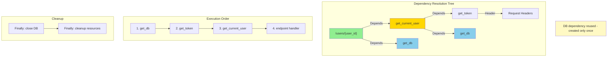
```mermaid
graph TB
    subgraph "Dependency Resolution Tree"
        Endpoint["/users/{user_id}"]
        
        Endpoint -->|Depends| CurrentUser[get_current_user]
        Endpoint -->|Depends| DB1[get_db]
        
        CurrentUser -->|Depends| Token[get_token]
        CurrentUser -->|Depends| DB2[get_db]
        
        Token -->|Header| Request[Request Headers]
    end
    
    subgraph "Execution Order"
        direction LR
        E1[1. get_db] --> E2[2. get_token]
        E2 --> E3[3. get_current_user]
        E3 --> E4[4. endpoint handler]
    end
    
    subgraph "Cleanup"
        direction LR
        C1[Finally: close DB] --> C2[Finally: cleanup resources]
    end
    
    style DB1 fill:#87CEEB
    style DB2 fill:#87CEEB
    style CurrentUser fill:#FFD700
    style Endpoint fill:#90EE90
    
    Note1[DB dependency reused - created only once]
    style Note1 fill:#FFF9C4
```

```python
from fastapi import Depends
from typing import Generator

# Database dependency
class Database:
    """Database connection."""
    def __init__(self):
        self.connected = True
    
    def get_user(self, user_id: int) -> Optional[dict]:
        return users_db.get(user_id)
    
    def close(self):
        self.connected = False

def get_db() -> Generator[Database, None, None]:
    """Database dependency."""
    db = Database()
    try:
        yield db
    finally:
        db.close()

# Authentication dependency
async def get_current_user(
    token: str = Header(..., alias="Authorization"),
    db: Database = Depends(get_db),
) -> dict:
    """Get current authenticated user."""
    # Simplified authentication
    if not token.startswith("Bearer "):
        raise HTTPException(
            status_code=status.HTTP_401_UNAUTHORIZED,
            detail="Invalid authentication credentials",
        )
    
    # In reality, verify token and get user
    user_id = 1  # Extracted from token
    user = db.get_user(user_id)
    
    if not user:
        raise HTTPException(
            status_code=status.HTTP_401_UNAUTHORIZED,
            detail="User not found",
        )
    
    return user

# Use dependencies in endpoints
@app.get("/me/", response_model=UserResponse)
async def get_current_user_info(
    current_user: dict = Depends(get_current_user),
) -> UserResponse:
    """Get current user information."""
    return UserResponse(**current_user)

# Dependency with parameters
class Pagination:
    """Pagination dependency."""
    def __init__(self, skip: int = 0, limit: int = 100):
        self.skip = skip
        self.limit = max(1, min(limit, 100))  # Enforce limits

@app.get("/items/")
async def list_items(
    pagination: Pagination = Depends(),
    db: Database = Depends(get_db),
):
    """List items with pagination dependency."""
    # Use pagination.skip and pagination.limit
    pass
```

### Error Handling & Middleware

```python
from fastapi import Request
from fastapi.responses import JSONResponse
from fastapi.middleware.cors import CORSMiddleware
import time

# Custom exception
class BusinessLogicError(Exception):
    """Custom business logic exception."""
    def __init__(self, message: str, error_code: str):
        self.message = message
        self.error_code = error_code

# Exception handler
@app.exception_handler(BusinessLogicError)
async def business_logic_error_handler(
    request: Request,
    exc: BusinessLogicError,
) -> JSONResponse:
    """Handle business logic errors."""
    return JSONResponse(
        status_code=status.HTTP_400_BAD_REQUEST,
        content={
            "error": exc.error_code,
            "message": exc.message,
        },
    )

# CORS middleware
app.add_middleware(
    CORSMiddleware,
    allow_origins=["*"],  # Configure appropriately
    allow_credentials=True,
    allow_methods=["*"],
    allow_headers=["*"],
)

# Custom middleware
@app.middleware("http")
async def add_process_time_header(request: Request, call_next):
    """Add response time header."""
    start_time = time.time()
    response = await call_next(request)
    process_time = time.time() - start_time
    response.headers["X-Process-Time"] = str(process_time)
    return response

# Request logging middleware
@app.middleware("http")
async def log_requests(request: Request, call_next):
    """Log all requests."""
    print(f"Request: {request.method} {request.url}")
    response = await call_next(request)
    print(f"Response: {response.status_code}")
    return response
```

### Advanced FastAPI Patterns

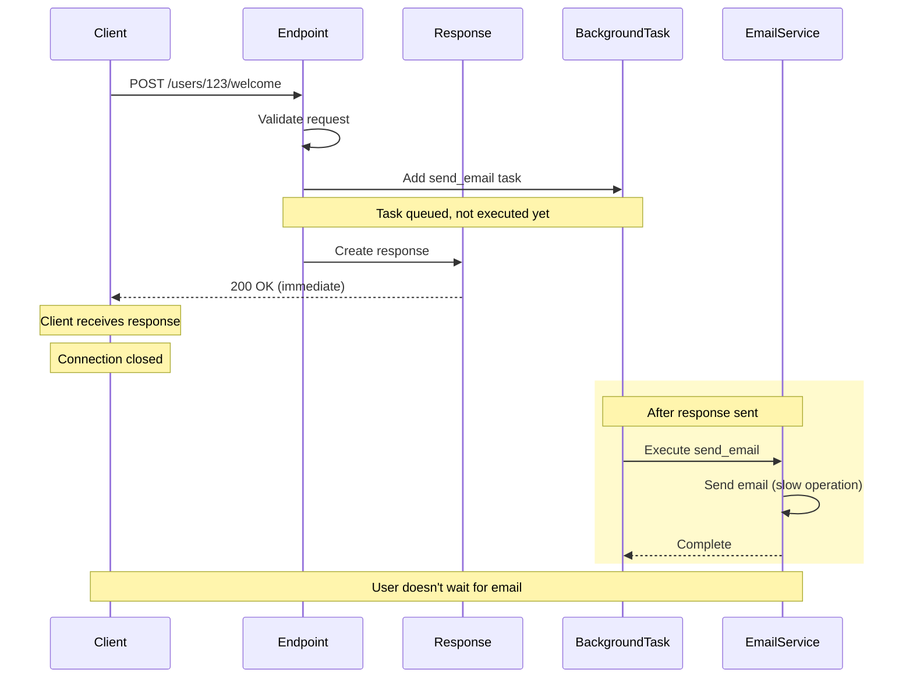
```mermaid
sequenceDiagram
    participant Client
    participant Endpoint
    participant Response
    participant BackgroundTask
    participant EmailService
    
    Client->>Endpoint: POST /users/123/welcome
    Endpoint->>Endpoint: Validate request
    Endpoint->>BackgroundTask: Add send_email task
    
    Note over Endpoint,BackgroundTask: Task queued, not executed yet
    
    Endpoint->>Response: Create response
    Response-->>Client: 200 OK (immediate)
    
    Note over Client: Client receives response
    Note over Client: Connection closed
    
    rect rgb(255, 250, 205)
        Note over BackgroundTask,EmailService: After response sent
        BackgroundTask->>EmailService: Execute send_email
        EmailService->>EmailService: Send email (slow operation)
        EmailService-->>BackgroundTask: Complete
    end
    
    Note over Client,EmailService: User doesn't wait for email
```

```python
from fastapi import BackgroundTasks
from fastapi.responses import StreamingResponse
import asyncio

# Background tasks
def send_email(email: str, message: str):
    """Send email in background."""
    print(f"Sending email to {email}: {message}")
    time.sleep(2)  # Simulate email sending

@app.post("/users/{user_id}/welcome/")
async def send_welcome_email(
    user_id: int,
    background_tasks: BackgroundTasks,
    db: Database = Depends(get_db),
):
    """Send welcome email in background."""
    user = db.get_user(user_id)
    if not user:
        raise HTTPException(status_code=404, detail="User not found")
    
    background_tasks.add_task(
        send_email,
        user["email"],
        "Welcome to our platform!",
    )
    
    return {"message": "Welcome email will be sent"}

# Streaming response
async def generate_large_data():
    """Generate data stream."""
    for i in range(100):
        await asyncio.sleep(0.1)
        yield f"data: {i}\n"

@app.get("/stream/")
async def stream_data():
    """Stream large dataset."""
    return StreamingResponse(
        generate_large_data(),
        media_type="text/event-stream",
    )

# WebSocket endpoint
from fastapi import WebSocket

@app.websocket("/ws/")
async def websocket_endpoint(websocket: WebSocket):
    """WebSocket connection."""
    await websocket.accept()
    try:
        while True:
            data = await websocket.receive_text()
            await websocket.send_text(f"Echo: {data}")
    except Exception:
        pass

# File upload
from fastapi import File, UploadFile

@app.post("/upload/")
async def upload_file(file: UploadFile = File(...)):
    """Upload file."""
    contents = await file.read()
    return {
        "filename": file.filename,
        "content_type": file.content_type,
        "size": len(contents),
    }
```

### Modular FastAPI Architecture

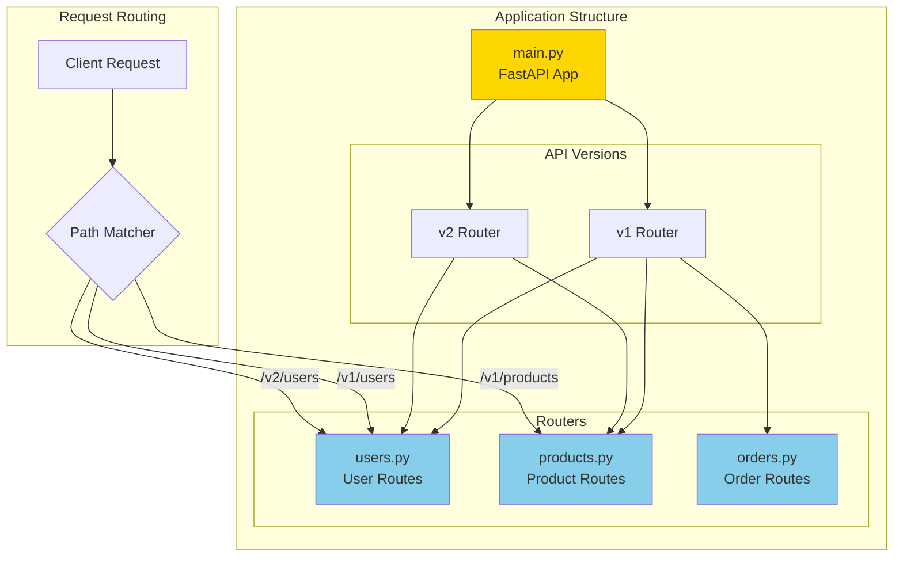
```mermaid
graph TB
    subgraph "Application Structure"
        Main[main.py<br/>FastAPI App]
        
        subgraph Routers
            UserRouter[users.py<br/>User Routes]
            ProductRouter[products.py<br/>Product Routes]
            OrderRouter[orders.py<br/>Order Routes]
        end
        
        subgraph "API Versions"
            V1[v1 Router]
            V2[v2 Router]
        end
        
        Main --> V1
        Main --> V2
        
        V1 --> UserRouter
        V1 --> ProductRouter
        V1 --> OrderRouter
        
        V2 --> UserRouter
        V2 --> ProductRouter
    end
    
    subgraph "Request Routing"
        Request[Client Request] --> Router{Path Matcher}
        Router -->|/v1/users| UserRouter
        Router -->|/v1/products| ProductRouter
        Router -->|/v2/users| UserRouter
    end
    
    style Main fill:#FFD700
    style UserRouter fill:#87CEEB
    style ProductRouter fill:#87CEEB
    style OrderRouter fill:#87CEEB
```

```python
# routers/users.py
from fastapi import APIRouter

user_router = APIRouter(
    prefix="/users",
    tags=["users"],
)

@user_router.get("/")
async def list_users():
    return {"users": []}

@user_router.post("/")
async def create_user():
    return {"user": {}}

# routers/products.py
product_router = APIRouter(
    prefix="/products",
    tags=["products"],
)

@product_router.get("/")
async def list_products():
    return {"products": []}

# main.py
from routers import user_router, product_router

app = FastAPI()
app.include_router(user_router)
app.include_router(product_router)

# Versioned API
v1_router = APIRouter(prefix="/v1")
v1_router.include_router(user_router)

v2_router = APIRouter(prefix="/v2")
v2_router.include_router(user_router)  # Could be different implementation

app.include_router(v1_router)
app.include_router(v2_router)
```

---

## Testing Strategies

Comprehensive testing approaches for Python applications.

### Unit Testing with pytest

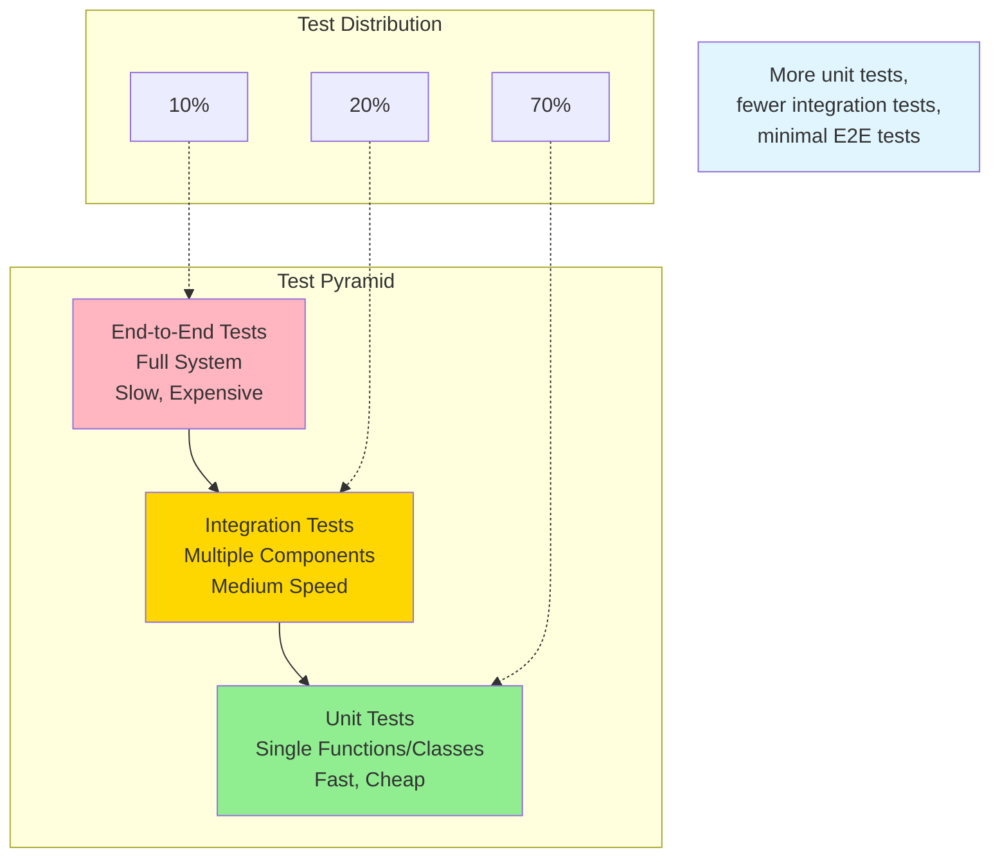
```mermaid
graph TB
    subgraph "Test Pyramid"
        E2E[End-to-End Tests<br/>Full System<br/>Slow, Expensive]
        Integration[Integration Tests<br/>Multiple Components<br/>Medium Speed]
        Unit[Unit Tests<br/>Single Functions/Classes<br/>Fast, Cheap]
    end
    
    E2E --> Integration
    Integration --> Unit
    
    subgraph "Test Distribution"
        Few[10%] -.-> E2E
        Some[20%] -.-> Integration
        Many[70%] -.-> Unit
    end
    
    style Unit fill:#90EE90
    style Integration fill:#FFD700
    style E2E fill:#FFB6C1
    
    Note1[More unit tests,<br/>fewer integration tests,<br/>minimal E2E tests]
    style Note1 fill:#E1F5FE
```

```python
# test_user_service.py
import pytest
from typing import Dict, Any

# Fixtures
@pytest.fixture
def mock_database():
    """Provide mock database."""
    return MockDatabase()

@pytest.fixture
def mock_cache():
    """Provide mock cache."""
    return MockCache()

@pytest.fixture
def user_service(mock_database, mock_cache):
    """Provide user service with mocked dependencies."""
    return UserService(database=mock_database, cache=mock_cache)

# Basic tests
def test_save_user(user_service):
    """Test saving a user."""
    user_data = {"name": "Alice", "email": "alice@example.com"}
    user_service.save_user("123", user_data)
    
    user = user_service.get_user("123")
    assert user is not None
    assert user["name"] == "Alice"

def test_get_nonexistent_user(user_service):
    """Test getting nonexistent user returns None."""
    user = user_service.get_user("999")
    assert user is None

# Parametrized tests
@pytest.mark.parametrize("user_id,expected", [
    ("1", {"name": "Alice"}),
    ("2", {"name": "Bob"}),
    ("3", None),
])
def test_get_user_parametrized(user_service, user_id, expected):
    """Test getting users with different IDs."""
    # Setup
    if expected:
        user_service.save_user(user_id, expected)
    
    # Test
    result = user_service.get_user(user_id)
    assert result == expected

# Exception testing
def test_invalid_user_data():
    """Test that invalid data raises exception."""
    with pytest.raises(ValueError) as exc_info:
        User(id=-1, name="", email="invalid")
    
    assert "validation error" in str(exc_info.value).lower()

# Async tests
@pytest.mark.asyncio
async def test_async_fetch():
    """Test async function."""
    result = await fetch_data("http://api.com", 0.1)
    assert result is not None
    assert "url" in result
```

### Integration Testing

```mermaid
graph LR
    subgraph "Fixture Dependency Graph"
        Test[test_user_workflow]
        
        Test -->|uses| Client[client fixture]
        Test -->|uses| DB[clean_database fixture]
        
        Client -->|depends on| App[app fixture]
        DB -->|depends on| DBConn[database_connection fixture]
        
        App -->|scope: function| AppNote[Created per test]
        DBConn -->|scope: session| DBNote[Created once]
    end
    
    subgraph "Execution Order"
        direction TB
        E1[1. Setup database_connection<br/>session scope] 
        E2[2. Setup clean_database<br/>function scope]
        E3[3. Setup app<br/>function scope]
        E4[4. Setup client<br/>function scope]
        E5[5. Run test]
        E6[6. Teardown fixtures<br/>reverse order]
        
        E1 --> E2 --> E3 --> E4 --> E5 --> E6
    end
    
    style Test fill:#90EE90
    style DBConn fill:#FFD700
    style E5 fill:#87CEEB
```

```python
# test_api_integration.py
from fastapi.testclient import TestClient
import pytest

@pytest.fixture
def client():
    """Provide test client."""
    return TestClient(app)

def test_create_user(client):
    """Test creating a user via API."""
    response = client.post(
        "/users/",
        json={
            "name": "Alice",
            "email": "alice@example.com",
            "age": 30,
        },
    )
    
    assert response.status_code == 201
    data = response.json()
    assert data["name"] == "Alice"
    assert "id" in data

def test_get_user(client):
    """Test getting a user via API."""
    # Create user first
    create_response = client.post(
        "/users/",
        json={"name": "Bob", "email": "bob@example.com"},
    )
    user_id = create_response.json()["id"]
    
    # Get user
    response = client.get(f"/users/{user_id}")
    assert response.status_code == 200
    assert response.json()["name"] == "Bob"

def test_get_nonexistent_user(client):
    """Test getting nonexistent user returns 404."""
    response = client.get("/users/99999")
    assert response.status_code == 404

def test_user_workflow(client):
    """Test complete user workflow."""
    # Create
    response = client.post(
        "/users/",
        json={"name": "Charlie", "email": "charlie@example.com"},
    )
    assert response.status_code == 201
    user_id = response.json()["id"]
    
    # Read
    response = client.get(f"/users/{user_id}")
    assert response.status_code == 200
    
    # Update
    response = client.put(
        f"/users/{user_id}",
        json={"name": "Charles"},
    )
    assert response.status_code == 200
    assert response.json()["name"] == "Charles"
    
    # Delete
    response = client.delete(f"/users/{user_id}")
    assert response.status_code == 204
    
    # Verify deleted
    response = client.get(f"/users/{user_id}")
    assert response.status_code == 404
```

### Mocking & Patching

```mermaid
flowchart LR
    subgraph "Production Code"
        Service1[UserService] -->|calls| RealDB[Real Database]
        Service1 -->|calls| RealAPI[External API]
        RealDB -->|network| DB[(PostgreSQL)]
        RealAPI -->|HTTP| API[api.external.com]
    end
    
    subgraph "Test Code"
        Service2[UserService] -->|calls| MockDB[Mock Database]
        Service2 -->|calls| MockAPI[Mock API]
        MockDB -->|in-memory| Memory[(Dict)]
        MockAPI -->|returns| Predefined[Predefined Responses]
    end
    
    subgraph "Benefits"
        Fast[Fast Execution]
        Isolated[No Side Effects]
        Reliable[Deterministic]
    end
    
    Test --> Benefits
    
    style Service1 fill:#FFB6C1
    style Service2 fill:#90EE90
    style MockDB fill:#87CEEB
    style MockAPI fill:#87CEEB
```

```python
from unittest.mock import Mock, patch, MagicMock
import pytest

# Mock objects
def test_with_mock():
    """Test using mock objects."""
    mock_db = Mock(spec=DatabaseInterface)
    mock_db.get.return_value = {"id": "123", "name": "Alice"}
    
    service = UserService(database=mock_db, cache=MockCache())
    user = service.get_user("123")
    
    # Verify mock was called
    mock_db.get.assert_called_once_with("123")
    assert user["name"] == "Alice"

# Patching
@patch('requests.get')
def test_api_call(mock_get):
    """Test API call with patched requests."""
    # Setup mock response
    mock_response = Mock()
    mock_response.json.return_value = {"data": "test"}
    mock_response.status_code = 200
    mock_get.return_value = mock_response
    
    # Test
    # result = fetch_from_api("http://api.com/data")
    # assert result["data"] == "test"
    
    # Verify call
    mock_get.assert_called_once()

# Context manager mocking
def test_file_operations():
    """Test file operations with mocking."""
    mock_file = MagicMock()
    mock_file.__enter__.return_value = mock_file
    mock_file.read.return_value = "test content"
    
    with patch('builtins.open', return_value=mock_file):
        with open('test.txt', 'r') as f:
            content = f.read()
        
        assert content == "test content"
```

### Test Coverage

```python
# Run with: pytest --cov=myapp --cov-report=html

# pytest.ini or pyproject.toml
# [tool.pytest.ini_options]
# testpaths = ["tests"]
# python_files = ["test_*.py"]
# python_classes = ["Test*"]
# python_functions = ["test_*"]
# addopts = "-v --cov=myapp --cov-report=term-missing"

# Coverage configuration
# [tool.coverage.run]
# source = ["myapp"]
# omit = ["*/tests/*", "*/migrations/*"]
# 
# [tool.coverage.report]
# exclude_lines = [
#     "pragma: no cover",
#     "def __repr__",
#     "raise AssertionError",
#     "raise NotImplementedError",
#     "if __name__ == .__main__.:",
# ]
```

### Test Organization Best Practices

```python
# tests/conftest.py - Shared fixtures
import pytest

@pytest.fixture(scope="session")
def database_connection():
    """Session-wide database connection."""
    conn = create_connection()
    yield conn
    conn.close()

@pytest.fixture(scope="function")
def clean_database(database_connection):
    """Clean database before each test."""
    database_connection.truncate_all()
    yield database_connection

# tests/test_models.py - Model tests
class TestUser:
    """User model tests."""
    
    def test_create_user(self):
        """Test user creation."""
        pass
    
    def test_user_validation(self):
        """Test user validation."""
        pass

# tests/test_services.py - Service tests
class TestUserService:
    """User service tests."""
    
    def test_get_user(self):
        """Test getting user."""
        pass
    
    def test_create_user(self):
        """Test creating user."""
        pass

# tests/test_api.py - API endpoint tests
class TestUserAPI:
    """User API tests."""
    
    def test_post_user(self, client):
        """Test POST /users/."""
        pass
    
    def test_get_user(self, client):
        """Test GET /users/{id}."""
        pass
```

---

## Modular Design Patterns

Architectural patterns for building maintainable, scalable applications.

### Repository Pattern

```mermaid
graph TB
    subgraph "Clean Architecture with Repository Pattern"
        API[API Layer<br/>FastAPI Endpoints]
        Service[Service Layer<br/>Business Logic]
        Repository[Repository Layer<br/>Data Access]
        Database[(Database)]
        
        API -->|calls| Service
        Service -->|calls| Repository
        Repository -->|queries| Database
        
        API -.->|depends on| ServiceInterface[IUserService]
        Service -.->|implements| ServiceInterface
        Service -.->|depends on| RepoInterface[IUserRepository]
        Repository -.->|implements| RepoInterface
    end
    
    subgraph "Dependency Flow"
        direction LR
        Abstraction[Abstractions<br/>Interfaces] -.->|stable| Concrete[Concrete<br/>Implementations]
    end
    
    subgraph "Benefits"
        B1[Testable<br/>Mock Repository]
        B2[Swappable<br/>Change DB easily]
        B3[Single Responsibility<br/>Separation of Concerns]
    end
    
    style API fill:#E1F5FE
    style Service fill:#FFF9C4
    style Repository fill:#F1F8E9
    style Database fill:#FFE0B2
```

```python
from abc import ABC, abstractmethod
from typing import List, Optional, Generic, TypeVar

T = TypeVar('T')

class Repository(ABC, Generic[T]):
    """Abstract repository interface."""
    
    @abstractmethod
    def get(self, id: int) -> Optional[T]:
        """Get entity by ID."""
        pass
    
    @abstractmethod
    def list(self, skip: int = 0, limit: int = 100) -> List[T]:
        """List entities."""
        pass
    
    @abstractmethod
    def create(self, entity: T) -> T:
        """Create entity."""
        pass
    
    @abstractmethod
    def update(self, id: int, entity: T) -> Optional[T]:
        """Update entity."""
        pass
    
    @abstractmethod
    def delete(self, id: int) -> bool:
        """Delete entity."""
        pass

class UserRepository(Repository[User]):
    """User repository implementation."""
    
    def __init__(self, db: Database):
        self.db = db
    
    def get(self, id: int) -> Optional[User]:
        """Get user by ID."""
        data = self.db.get(f"user:{id}")
        return User(**data) if data else None
    
    def list(self, skip: int = 0, limit: int = 100) -> List[User]:
        """List users."""
        users_data = self.db.list("user:", skip, limit)
        return [User(**data) for data in users_data]
    
    def create(self, user: User) -> User:
        """Create user."""
        user_dict = user.dict()
        self.db.save(f"user:{user.id}", user_dict)
        return user
    
    def update(self, id: int, user: User) -> Optional[User]:
        """Update user."""
        if not self.db.exists(f"user:{id}"):
            return None
        user_dict = user.dict()
        self.db.save(f"user:{id}", user_dict)
        return user
    
    def delete(self, id: int) -> bool:
        """Delete user."""
        return self.db.delete(f"user:{id}")

# Usage
class UserService:
    """User service using repository."""
    
    def __init__(self, user_repo: UserRepository):
        self.user_repo = user_repo
    
    def register_user(self, user_data: UserCreate) -> User:
        """Register new user."""
        user = User(id=generate_id(), **user_data.dict())
        return self.user_repo.create(user)
    
    def get_user_profile(self, user_id: int) -> Optional[User]:
        """Get user profile."""
        return self.user_repo.get(user_id)
```

### Service Layer Pattern

```mermaid
sequenceDiagram
    participant Client
    participant API
    participant UserService
    participant UserRepository
    participant EmailService
    participant Cache
    participant Database
    
    Client->>API: POST /users/register
    API->>UserService: register_user(user_data)
    
    rect rgb(255, 250, 205)
        Note over UserService: Business Logic Layer
        UserService->>UserRepository: email_exists(email)?
        UserRepository->>Database: SELECT ... WHERE email
        Database-->>UserRepository: No results
        UserRepository-->>UserService: False
        
        UserService->>UserService: Validate business rules
        UserService->>UserRepository: create(user)
        UserRepository->>Database: INSERT user
        Database-->>UserRepository: User created
        UserRepository-->>UserService: User object
        
        UserService->>EmailService: send_welcome_email(email)
        EmailService-->>UserService: Email queued
        
        UserService->>Cache: set(user:id, user_data)
        Cache-->>UserService: Cached
    end
    
    UserService-->>API: User object
    API-->>Client: 201 Created
    
    Note over UserService,Database: Single transaction, multiple operations
```

```python
class UserService:
    """Business logic layer for users."""
    
    def __init__(
        self,
        user_repo: UserRepository,
        email_service: EmailService,
        cache: CacheInterface,
    ):
        self.user_repo = user_repo
        self.email_service = email_service
        self.cache = cache
    
    async def register_user(self, user_data: UserCreate) -> User:
        """Register user with validation and side effects."""
        # Business logic validation
        if await self._email_exists(user_data.email):
            raise BusinessLogicError(
                "Email already registered",
                "EMAIL_EXISTS",
            )
        
        # Create user
        user = User(id=generate_id(), **user_data.dict())
        user = self.user_repo.create(user)
        
        # Side effects
        await self.email_service.send_welcome_email(user.email)
        self.cache.set(f"user:{user.id}", user.dict())
        
        return user
    
    async def _email_exists(self, email: str) -> bool:
        """Check if email already exists."""
        # Implementation
        return False

class ProductService:
    """Business logic layer for products."""
    
    def __init__(
        self,
        product_repo: ProductRepository,
        inventory_service: InventoryService,
    ):
        self.product_repo = product_repo
        self.inventory_service = inventory_service
    
    async def create_product(self, product_data: ProductCreate) -> Product:
        """Create product with inventory."""
        # Create product
        product = Product(id=generate_id(), **product_data.dict())
        product = self.product_repo.create(product)
        
        # Initialize inventory
        await self.inventory_service.initialize_stock(
            product.id,
            quantity=0,
        )
        
        return product
```

### Unit of Work Pattern

```mermaid
stateDiagram-v2
    [*] --> UnitOfWorkStarted: Begin UoW
    UnitOfWorkStarted --> TrackingChanges: Track entities
    
    state TrackingChanges {
        [*] --> RegisterNew: user_repo.create()
        [*] --> RegisterDirty: user.balance -= 100
        [*] --> RegisterRemoved: user_repo.delete()
        
        RegisterNew --> Tracked
        RegisterDirty --> Tracked
        RegisterRemoved --> Tracked
    }
    
    TrackingChanges --> Commit: commit()
    TrackingChanges --> Rollback: Exception
    
    state Commit {
        [*] --> InsertNew
        InsertNew --> UpdateDirty
        UpdateDirty --> DeleteRemoved
        DeleteRemoved --> [*]
    }
    
    Commit --> [*]: Success
    Rollback --> [*]: All changes discarded
    
    note right of Commit
        All or nothing:
        Atomic transaction
    end note
    
    note right of Rollback
        Exception occurred:
        No partial changes
    end note
```

```python
from contextlib import contextmanager
from typing import List

class UnitOfWork:
    """Coordinate multiple repository operations."""
    
    def __init__(self, db: Database):
        self.db = db
        self.user_repo = UserRepository(db)
        self.product_repo = ProductRepository(db)
        self._new_entities: List = []
        self._dirty_entities: List = []
        self._removed_entities: List = []
    
    def register_new(self, entity):
        """Register new entity."""
        self._new_entities.append(entity)
    
    def register_dirty(self, entity):
        """Register modified entity."""
        if entity not in self._dirty_entities:
            self._dirty_entities.append(entity)
    
    def register_removed(self, entity):
        """Register removed entity."""
        self._removed_entities.append(entity)
    
    def commit(self):
        """Commit all changes."""
        # Save new entities
        for entity in self._new_entities:
            self.db.insert(entity)
        
        # Update dirty entities
        for entity in self._dirty_entities:
            self.db.update(entity)
        
        # Remove entities
        for entity in self._removed_entities:
            self.db.delete(entity)
        
        # Clear tracking
        self._new_entities.clear()
        self._dirty_entities.clear()
        self._removed_entities.clear()
    
    def rollback(self):
        """Rollback all changes."""
        self._new_entities.clear()
        self._dirty_entities.clear()
        self._removed_entities.clear()

@contextmanager
def unit_of_work(db: Database):
    """Context manager for unit of work."""
    uow = UnitOfWork(db)
    try:
        yield uow
        uow.commit()
    except Exception:
        uow.rollback()
        raise

# Usage
def transfer_funds(from_user_id: int, to_user_id: int, amount: float):
    """Transfer funds between users (atomic operation)."""
    with unit_of_work(database) as uow:
        from_user = uow.user_repo.get(from_user_id)
        to_user = uow.user_repo.get(to_user_id)
        
        # Business logic
        if from_user.balance < amount:
            raise ValueError("Insufficient funds")
        
        # Modify entities
        from_user.balance -= amount
        to_user.balance += amount
        
        # Register changes
        uow.register_dirty(from_user)
        uow.register_dirty(to_user)
        
        # Commit happens automatically
```

### Layered Architecture

```mermaid
graph TB
    subgraph "Layered Architecture - Dependency Direction"
        API[Presentation Layer<br/>FastAPI Endpoints<br/>Request/Response Models]
        Service[Business Logic Layer<br/>Services<br/>Domain Rules & Orchestration]
        Repository[Data Access Layer<br/>Repositories<br/>Database Queries]
        Domain[Domain Layer<br/>Entities & Models<br/>Pure Business Objects]
        
        API -->|depends on| Service
        Service -->|depends on| Repository
        Service -->|depends on| Domain
        Repository -->|depends on| Domain
        
        API -.->|HTTP/JSON| External1[External Clients]
        Repository -.->|SQL| External2[(Database)]
    end
    
    subgraph "Layer Rules"
        R1[Each layer only depends on layers below]
        R2[No circular dependencies]
        R3[Domain layer has NO dependencies]
    end
    
    subgraph "Benefits"
        B1[Maintainable]
        B2[Testable]
        B3[Replaceable]
    end
    
    style Domain fill:#90EE90
    style Repository fill:#87CEEB
    style Service fill:#FFD700
    style API fill:#FFB6C1
```

```python
# Layer 1: Domain Models (Pure Python, no dependencies)
# models.py
from dataclasses import dataclass
from datetime import datetime

@dataclass
class User:
    """Domain model."""
    id: int
    name: str
    email: str
    created_at: datetime

# Layer 2: Repository (Data Access)
# repositories.py
class UserRepository:
    """Data access layer."""
    def __init__(self, db: Database):
        self.db = db

# Layer 3: Services (Business Logic)
# services.py
class UserService:
    """Business logic layer."""
    def __init__(self, user_repo: UserRepository):
        self.user_repo = user_repo

# Layer 4: API (Presentation)
# api.py
@app.post("/users/")
async def create_user(
    user_data: UserCreate,
    service: UserService = Depends(get_user_service),
):
    """API endpoint."""
    return service.register_user(user_data)

# Dependency injection glue
# dependencies.py
def get_database() -> Database:
    """Get database connection."""
    return Database()

def get_user_repository(
    db: Database = Depends(get_database),
) -> UserRepository:
    """Get user repository."""
    return UserRepository(db)

def get_user_service(
    repo: UserRepository = Depends(get_user_repository),
) -> UserService:
    """Get user service."""
    return UserService(repo)
```

### Event-Driven Architecture

```mermaid
sequenceDiagram
    participant UserService
    participant EventBus
    participant EmailHandler
    participant AnalyticsHandler
    participant NotificationHandler
    
    Note over UserService: User registers
    UserService->>UserService: Create user in DB
    UserService->>EventBus: publish(UserRegisteredEvent)
    
    par Async Event Handling
        EventBus->>EmailHandler: UserRegisteredEvent
        EmailHandler->>EmailHandler: Send welcome email
        EmailHandler-->>EventBus: Done
    and
        EventBus->>AnalyticsHandler: UserRegisteredEvent
        AnalyticsHandler->>AnalyticsHandler: Track analytics
        AnalyticsHandler-->>EventBus: Done
    and
        EventBus->>NotificationHandler: UserRegisteredEvent
        NotificationHandler->>NotificationHandler: Send notification
        NotificationHandler-->>EventBus: Done
    end
    
    EventBus-->>UserService: All handlers completed
    
    Note over UserService,NotificationHandler: Loose coupling: UserService doesn't know about handlers
```

### Event Flow Architecture

```mermaid
graph LR
    subgraph "Event Publishers"
        UserService[User Service]
        OrderService[Order Service]
        PaymentService[Payment Service]
    end
    
    subgraph "Event Bus"
        EB[Central Event Bus<br/>Pub/Sub Pattern]
    end
    
    subgraph "Event Subscribers"
        Email[Email Handler]
        Analytics[Analytics Handler]
        Notification[Notification Handler]
        Audit[Audit Logger]
    end
    
    UserService -->|UserRegistered| EB
    OrderService -->|OrderPlaced| EB
    PaymentService -->|PaymentProcessed| EB
    
    EB -->|subscribes| Email
    EB -->|subscribes| Analytics
    EB -->|subscribes| Notification
    EB -->|subscribes| Audit
    
    style EB fill:#FFD700
    style Email fill:#90EE90
    style Analytics fill:#90EE90
    style Notification fill:#90EE90
    style Audit fill:#90EE90
```

```python
from typing import List, Callable
from dataclasses import dataclass
from datetime import datetime

# Event base class
@dataclass
class Event:
    """Base event class."""
    timestamp: datetime
    event_type: str

@dataclass
class UserRegisteredEvent(Event):
    """User registered event."""
    user_id: int
    email: str

@dataclass
class OrderPlacedEvent(Event):
    """Order placed event."""
    order_id: int
    user_id: int
    total: float

# Event bus
class EventBus:
    """Central event dispatcher."""
    def __init__(self):
        self._handlers: Dict[str, List[Callable]] = {}
    
    def subscribe(self, event_type: str, handler: Callable):
        """Subscribe to event type."""
        if event_type not in self._handlers:
            self._handlers[event_type] = []
        self._handlers[event_type].append(handler)
    
    async def publish(self, event: Event):
        """Publish event to all subscribers."""
        event_type = event.event_type
        if event_type in self._handlers:
            for handler in self._handlers[event_type]:
                await handler(event)

# Event handlers
class EmailEventHandler:
    """Handle email-related events."""
    def __init__(self, email_service: EmailService):
        self.email_service = email_service
    
    async def handle_user_registered(self, event: UserRegisteredEvent):
        """Send welcome email on user registration."""
        await self.email_service.send_welcome_email(event.email)

class AnalyticsEventHandler:
    """Handle analytics events."""
    async def handle_user_registered(self, event: UserRegisteredEvent):
        """Track user registration."""
        # await analytics.track("user_registered", {...})
        pass

# Setup
event_bus = EventBus()
email_handler = EmailEventHandler(email_service)
analytics_handler = AnalyticsEventHandler()

event_bus.subscribe("user_registered", email_handler.handle_user_registered)
event_bus.subscribe("user_registered", analytics_handler.handle_user_registered)

# Usage in service
class UserService:
    """User service with events."""
    def __init__(
        self,
        user_repo: UserRepository,
        event_bus: EventBus,
    ):
        self.user_repo = user_repo
        self.event_bus = event_bus
    
    async def register_user(self, user_data: UserCreate) -> User:
        """Register user and publish event."""
        user = User(id=generate_id(), **user_data.dict())
        user = self.user_repo.create(user)
        
        # Publish event
        event = UserRegisteredEvent(
            timestamp=datetime.now(),
            event_type="user_registered",
            user_id=user.id,
            email=user.email,
        )
        await self.event_bus.publish(event)
        
        return user
```

---

## Summary

This guide covered:

1. **Decorators**: Function/class modification, caching, timing, validation
2. **Generators**: Memory-efficient iteration, pipelines, coroutines
3. **Async/Await**: Concurrent I/O operations, async patterns
4. **Context Managers**: Resource management, cleanup guarantees
5. **Performance**: Profiling, memory optimization, benchmarking
6. **Type Hints**: Static typing, Pydantic validation
7. **Dependency Injection**: Loose coupling, testability
8. **FastAPI**: Modern API development, routing, middleware
9. **Testing**: Unit/integration tests, mocking, coverage
10. **Design Patterns**: Repository, service layer, event-driven

Each concept builds toward creating production-ready, maintainable Python applications with modern best practices.

---

## Complete System Architecture Overview

```mermaid
graph TB
    subgraph "Client Layer"
        WebClient[Web Browser]
        MobileClient[Mobile App]
        APIClient[External API Client]
    end
    
    subgraph "API Gateway Layer"
        FastAPI[FastAPI Application]
        Middleware[Middleware<br/>CORS, Auth, Logging]
        Router[Request Router<br/>v1, v2 endpoints]
    end
    
    subgraph "Service Layer - Business Logic"
        UserService[User Service]
        ProductService[Product Service]
        OrderService[Order Service]
        EventBus[Event Bus]
    end
    
    subgraph "Repository Layer - Data Access"
        UserRepo[User Repository]
        ProductRepo[Product Repository]
        OrderRepo[Order Repository]
    end
    
    subgraph "Infrastructure Layer"
        Database[(PostgreSQL)]
        Cache[(Redis Cache)]
        Queue[Message Queue]
        FileStorage[S3 Storage]
    end
    
    subgraph "External Services"
        EmailService[Email Service]
        PaymentGateway[Payment Gateway]
        Analytics[Analytics Platform]
    end
    
    WebClient --> FastAPI
    MobileClient --> FastAPI
    APIClient --> FastAPI
    
    FastAPI --> Middleware
    Middleware --> Router
    
    Router --> UserService
    Router --> ProductService
    Router --> OrderService
    
    UserService --> UserRepo
    ProductService --> ProductRepo
    OrderService --> OrderRepo
    
    UserService --> EventBus
    ProductService --> EventBus
    OrderService --> EventBus
    
    UserRepo --> Database
    ProductRepo --> Database
    OrderRepo --> Database
    
    UserService --> Cache
    ProductService --> Cache
    
    EventBus --> EmailService
    EventBus --> Analytics
    
    OrderService --> PaymentGateway
    ProductService --> FileStorage
    
    style FastAPI fill:#FFD700
    style UserService fill:#87CEEB
    style ProductService fill:#87CEEB
    style OrderService fill:#87CEEB
    style Database fill:#FFB6C1
    style Cache fill:#98FB98
    style EventBus fill:#DDA0DD
```

### Request Flow with All Patterns Combined

```mermaid
sequenceDiagram
    participant Client
    participant FastAPI
    participant Middleware
    participant Dependency
    participant Service
    participant Repository
    participant Database
    participant Cache
    participant EventBus
    participant EmailHandler
    
    Client->>FastAPI: POST /api/v1/users
    FastAPI->>Middleware: Process request
    
    rect rgb(255, 250, 205)
        Note over Middleware: Middleware Chain
        Middleware->>Middleware: CORS headers
        Middleware->>Middleware: Log request
        Middleware->>Middleware: Authenticate
    end
    
    Middleware->>Dependency: Resolve dependencies
    
    rect rgb(230, 230, 250)
        Note over Dependency: Dependency Injection
        Dependency->>Dependency: get_db()
        Dependency->>Dependency: get_cache()
        Dependency->>Dependency: get_user_service()
    end
    
    Dependency->>Service: register_user(user_data)
    
    rect rgb(255, 240, 245)
        Note over Service,Cache: Service Layer
        Service->>Repository: email_exists()?
        Repository->>Database: SELECT query
        Database-->>Repository: False
        Repository-->>Service: Not exists
        
        Service->>Repository: create(user)
        Repository->>Database: INSERT user
        Database-->>Repository: User created
        Repository-->>Service: User object
        
        Service->>Cache: cache_user(user)
        Cache-->>Service: Cached
        
        Service->>EventBus: publish(UserRegisteredEvent)
    end
    
    par Background Event Handling
        EventBus->>EmailHandler: UserRegisteredEvent
        EmailHandler->>EmailHandler: Send welcome email
    end
    
    Service-->>FastAPI: User response
    FastAPI-->>Client: 201 Created
    
    Note over Client,EmailHandler: Clean separation of concerns
```